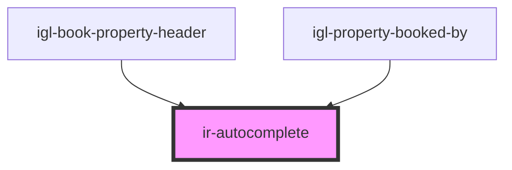

# ir-autocomplete

<!-- Auto Generated Below -->

## Properties

| Property         | Attribute          | Description | Type                                                      | Default     |
| ---------------- | ------------------ | ----------- | --------------------------------------------------------- | ----------- |
| `danger_border`  | `danger_border`    |             | `boolean`                                                 | `undefined` |
| `disabled`       | `disabled`         |             | `boolean`                                                 | `false`     |
| `duration`       | `duration`         |             | `number`                                                  | `300`       |
| `from_date`      | `from_date`        |             | `string`                                                  | `''`        |
| `inputId`        | `input-id`         |             | `string`                                                  | `v4()`      |
| `isSplitBooking` | `is-split-booking` |             | `boolean`                                                 | `false`     |
| `name`           | `name`             |             | `string`                                                  | `''`        |
| `placeholder`    | `placeholder`      |             | `string`                                                  | `''`        |
| `propertyId`     | `property-id`      |             | `number`                                                  | `undefined` |
| `required`       | `required`         |             | `boolean`                                                 | `false`     |
| `to_date`        | `to_date`          |             | `string`                                                  | `''`        |
| `type`           | `type`             |             | `"email" \| "number" \| "password" \| "search" \| "text"` | `'text'`    |
| `value`          | `value`            |             | `string`                                                  | `undefined` |

## Events

| Event           | Description | Type                                                                                                 |
| --------------- | ----------- | ---------------------------------------------------------------------------------------------------- |
| `comboboxValue` |             | `CustomEvent<{ key: string; data: unknown; }>`                                                       |
| `inputCleared`  |             | `CustomEvent<null>`                                                                                  |
| `toast`         |             | `CustomEvent<ICustomToast & Partial<IToastWithButton> \| IDefaultToast & Partial<IToastWithButton>>` |

## Dependencies

### Used by

 - [igl-book-property-header](../igloo-calendar/igl-book-property/igl-book-property-header)
 - [igl-property-booked-by](../igloo-calendar/igl-book-property/igl-booking-form/igl-property-booked-by)

### Graph

----------------------------------------------

*Built with [StencilJS](https://stenciljs.com/)*
