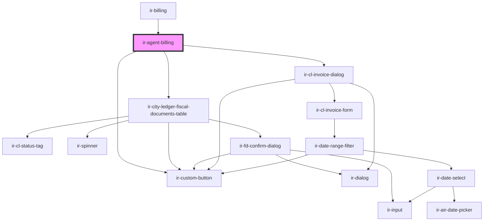

# ir-agent-billing

<!-- Auto Generated Below -->

## Properties

| Property  | Attribute | Description | Type      | Default     |
| --------- | --------- | ----------- | --------- | ----------- |
| `booking` | --        |             | `Booking` | `undefined` |

## Dependencies

### Used by

 - [ir-billing](..)

### Depends on

- [ir-custom-button](../../ui/ir-custom-button)
- [ir-city-ledger-fiscal-documents-table](../../ir-city-ledger/ir-city-ledger-fiscal-documents/ir-city-ledger-fiscal-documents-table)
- [ir-cl-invoice-dialog](../../ir-city-ledger/ir-cl-invoice-dialog)

### Graph

----------------------------------------------

*Built with [StencilJS](https://stenciljs.com/)*
