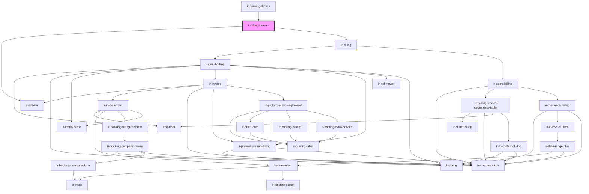

# ir-billing-drawer

<!-- Auto Generated Below -->

## Properties

| Property                  | Attribute                     | Description                                                                                                                                                               | Type                                                                                                                                                                                                                                                                                                                                                                                                                                                                                                                                                                                                                                                                                                                                                                            | Default     |
| ------------------------- | ----------------------------- | ------------------------------------------------------------------------------------------------------------------------------------------------------------------------- | ------------------------------------------------------------------------------------------------------------------------------------------------------------------------------------------------------------------------------------------------------------------------------------------------------------------------------------------------------------------------------------------------------------------------------------------------------------------------------------------------------------------------------------------------------------------------------------------------------------------------------------------------------------------------------------------------------------------------------------------------------------------------------- | ----------- |
| `agent`                   | --                            |                                                                                                                                                                           | `{ name?: string; id?: number; email?: string; property_id?: any; code?: string; address?: string; agent_rate_type_code?: { code?: string; description?: string; }; agent_type_code?: { code?: string; description?: string; }; city?: string; contact_name?: string; contract_nbr?: any; country_id?: number; currency_id?: any; due_balance?: any; email_copied_upon_booking?: string; is_active?: boolean; is_send_guest_confirmation_email?: boolean; notes?: string; payment_mode?: { code?: string; description?: string; }; phone?: string; provided_discount?: any; question?: string; sort_order?: any; tax_nbr?: string; reference?: string; verification_mode?: string; has_opening_balance?: boolean; cl_post_timing?: { code?: string; description?: string; }; }` | `undefined` |
| `booking`                 | --                            | The booking object containing reservation and guest details that will be used to populate the billing view.                                                               | `Booking`                                                                                                                                                                                                                                                                                                                                                                                                                                                                                                                                                                                                                                                                                                                                                                       | `undefined` |
| `isAllServicesAgentOwned` | `is-all-services-agent-owned` |                                                                                                                                                                           | `boolean`                                                                                                                                                                                                                                                                                                                                                                                                                                                                                                                                                                                                                                                                                                                                                                       | `undefined` |
| `open`                    | `open`                        | Controls whether the billing drawer is open or closed.  When `true`, the drawer becomes visible. When `false`, it is hidden.  This prop is reflected to the host element. | `boolean`                                                                                                                                                                                                                                                                                                                                                                                                                                                                                                                                                                                                                                                                                                                                                                       | `undefined` |

## Events

| Event          | Description                                                                                                | Type                |
| -------------- | ---------------------------------------------------------------------------------------------------------- | ------------------- |
| `billingClose` | Emitted when the billing drawer has been closed.  Listen to this event to respond to drawer close actions. | `CustomEvent<void>` |

## Dependencies

### Used by

 - [ir-booking-details](../../ir-booking-details)

### Depends on

- [ir-drawer](../../ir-drawer)
- [ir-billing](..)

### Graph

----------------------------------------------

*Built with [StencilJS](https://stenciljs.com/)*
