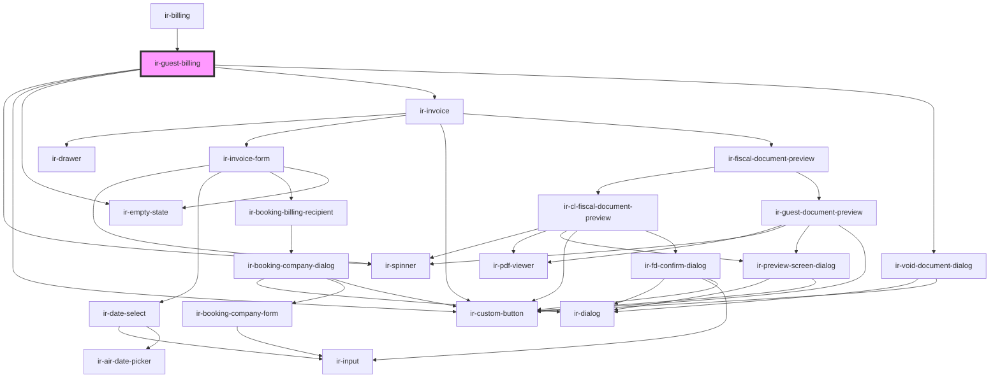

# ir-guest-billing

<!-- Auto Generated Below -->

## Properties

| Property  | Attribute | Description | Type      | Default     |
| --------- | --------- | ----------- | --------- | ----------- |
| `booking` | --        |             | `Booking` | `undefined` |

## Events

| Event                  | Description                                                                                                                  | Type                                       |
| ---------------------- | ---------------------------------------------------------------------------------------------------------------------------- | ------------------------------------------ |
| `billingClose`         |                                                                                                                              | `CustomEvent<void>`                        |
| `guestDocumentPreview` |                                                                                                                              | `CustomEvent<GuestDocumentPreviewRequest>` |
| `resetBookingEvt`      | Refreshes the wider booking-details tree. Emit with a Booking payload to skip ir-booking-details' full-page loading spinner. | `CustomEvent<Booking>`                     |

## Dependencies

### Used by

 - [ir-billing](..)

### Depends on

- [ir-spinner](../../ui/ir-spinner)
- [ir-custom-button](../../ui/ir-custom-button)
- [ir-empty-state](../../ir-empty-state)
- [ir-invoice](../../ir-invoice)
- [ir-void-document-dialog](../../ir-booking-details/ir-void-document-dialog)

### Graph

----------------------------------------------

*Built with [StencilJS](https://stenciljs.com/)*
