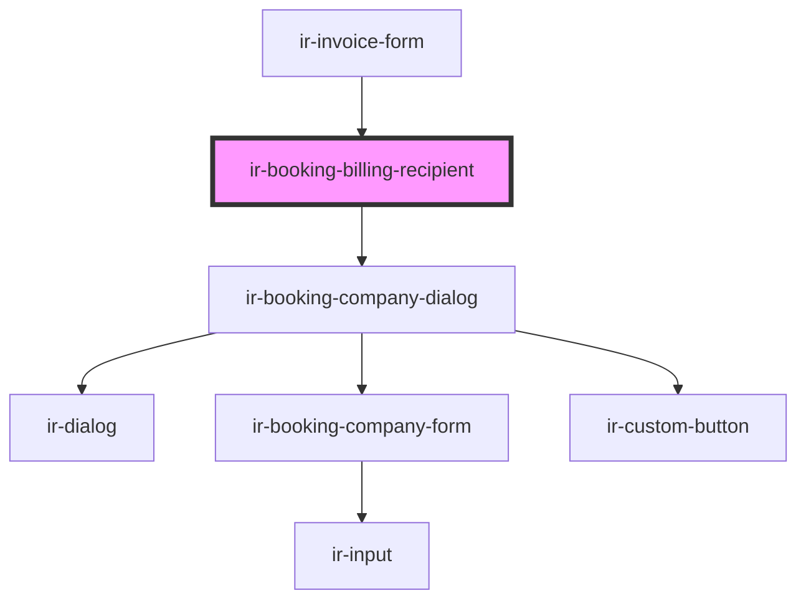

# ir-booking-billing-recipient

<!-- Auto Generated Below -->

## Properties

| Property  | Attribute | Description | Type      | Default     |
| --------- | --------- | ----------- | --------- | ----------- |
| `booking` | --        |             | `Booking` | `undefined` |

## Events

| Event             | Description | Type                  |
| ----------------- | ----------- | --------------------- |
| `recipientChange` |             | `CustomEvent<string>` |

## Dependencies

### Used by

 - [ir-invoice-form](../ir-invoice/ir-invoice-form)

### Depends on

- [ir-booking-company-dialog](../ir-booking-company-dialog)

### Graph

----------------------------------------------

*Built with [StencilJS](https://stenciljs.com/)*
