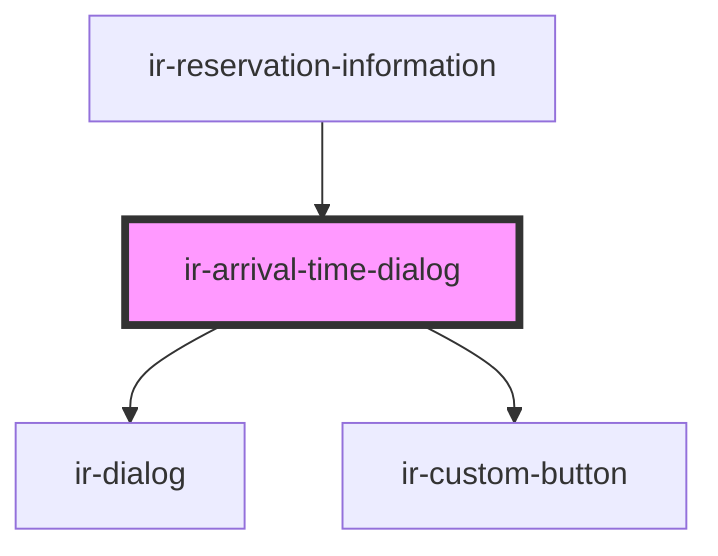

# ir-arrival-time-dialog

<!-- Auto Generated Below -->

## Properties

| Property      | Attribute | Description | Type         | Default     |
| ------------- | --------- | ----------- | ------------ | ----------- |
| `arrivalTime` | --        |             | `IEntries[]` | `[]`        |
| `booking`     | --        |             | `Booking`    | `undefined` |

## Events

| Event             | Description | Type                   |
| ----------------- | ----------- | ---------------------- |
| `resetBookingEvt` |             | `CustomEvent<Booking>` |

## Methods

### `closeDialog() => Promise<void>`

#### Returns

Type: `Promise<void>`

### `openDialog() => Promise<void>`

#### Returns

Type: `Promise<void>`

## Dependencies

### Used by

 - [ir-reservation-information](../../ir-reservation-information)

### Depends on

- [ir-dialog](../../../ui/ir-dialog)
- [ir-custom-button](../../../ui/ir-custom-button)

### Graph

----------------------------------------------

*Built with [StencilJS](https://stenciljs.com/)*
