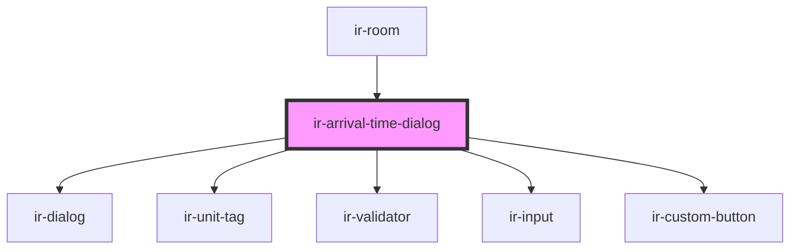

# ir-arrival-time-dialog

<!-- Auto Generated Below -->

## Overview

Dialog that lets staff set or change the expected arrival time for a single room.
Persists the choice via BookingService.setArrivalTime and emits `arrivalTimeClose`
when it closes so the parent can refresh the booking.

Usage:
  <ir-arrival-time-dialog
    room={room}
    open={isOpen}
    property_id={propertyId}
    arrivalTime={arrivalTimeEntries}
    onArrivalTimeClose={e => { isOpen = false; if (e.detail.saved) refresh(); }}
  />

## Properties

| Property         | Attribute         | Description                                                                             | Type         | Default     |
| ---------------- | ----------------- | --------------------------------------------------------------------------------------- | ------------ | ----------- |
| `arrivalTime`    | --                |                                                                                         | `IEntries[]` | `[]`        |
| `booking`        | --                | Needed to look up whether this room already has an early-check-in extra service charge. | `Booking`    | `undefined` |
| `booking_nbr`    | `booking_nbr`     | Needed to create an early-check-in extra service charge alongside the arrival time.     | `string`     | `undefined` |
| `currencySymbol` | `currency-symbol` |                                                                                         | `string`     | `undefined` |
| `currency_id`    | `currency_id`     |                                                                                         | `number`     | `undefined` |
| `language`       | `language`        |                                                                                         | `string`     | `'en'`      |
| `open`           | `open`            | Controls dialog visibility.                                                             | `boolean`    | `undefined` |
| `property_id`    | `property_id`     |                                                                                         | `number`     | `undefined` |
| `room`           | --                | Room whose expected arrival time is being changed.                                      | `Room`       | `undefined` |

## Events

| Event              | Description                                                                                                | Type                               |
| ------------------ | ---------------------------------------------------------------------------------------------------------- | ---------------------------------- |
| `arrivalTimeClose` | Fired when the dialog closes. `saved: true` → arrival time was persisted; `saved: false` → user cancelled. | `CustomEvent<{ saved: boolean; }>` |

## Dependencies

### Used by

 - [ir-room](../../ir-room)

### Depends on

- [ir-dialog](../../../ui/ir-dialog)
- [ir-unit-tag](../../../ir-unit-tag)
- [ir-validator](../../../ui/ir-validator)
- [ir-input](../../../ui/ir-input)
- [ir-custom-button](../../../ui/ir-custom-button)

### Graph

```mermaid
graph TD;
  ir-arrival-time-dialog --> ir-dialog
  ir-arrival-time-dialog --> ir-unit-tag
  ir-arrival-time-dialog --> ir-validator
  ir-arrival-time-dialog --> ir-input
  ir-arrival-time-dialog --> ir-custom-button
  ir-room --> ir-arrival-time-dialog
  style ir-arrival-time-dialog fill:#f9f,stroke:#333,stroke-width:4px
```

----------------------------------------------

*Built with [StencilJS](https://stenciljs.com/)*
