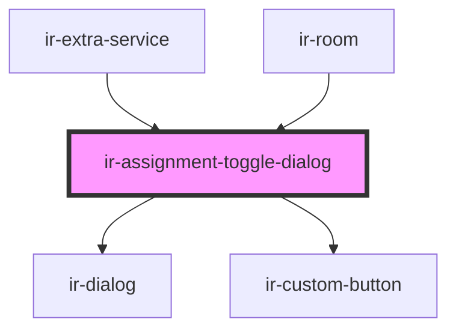

# ir-assignment-toggle-dialog

<!-- Auto Generated Below -->

## Properties

| Property       | Attribute       | Description                                                                                           | Type      | Default           |
| -------------- | --------------- | ----------------------------------------------------------------------------------------------------- | --------- | ----------------- |
| `cancelLabel`  | `cancel-label`  | Cancel button label                                                                                   | `string`  | `'Cancel'`        |
| `confirmLabel` | `confirm-label` | Confirm button label                                                                                  | `string`  | `'Confirm'`       |
| `label`        | `label`         | Dialog header title                                                                                   | `string`  | `'Are you sure?'` |
| `loading`      | `loading`       | Controls the loading spinner on the confirm button — set by the parent while the async operation runs | `boolean` | `false`           |
| `message`      | `message`       | Message shown inside the dialog                                                                       | `string`  | `undefined`       |

## Events

| Event           | Description                          | Type                |
| --------------- | ------------------------------------ | ------------------- |
| `confirmToggle` | Emitted when the user clicks confirm | `CustomEvent<void>` |

## Methods

### `closeModal() => Promise<void>`

#### Returns

Type: `Promise<void>`

### `openModal() => Promise<void>`

#### Returns

Type: `Promise<void>`

## Dependencies

### Used by

 - [ir-extra-service](../ir-extra-services/ir-extra-service)
 - [ir-room](../ir-room)

### Depends on

- [ir-dialog](../../ui/ir-dialog)
- [ir-custom-button](../../ui/ir-custom-button)

### Graph

----------------------------------------------

*Built with [StencilJS](https://stenciljs.com/)*
