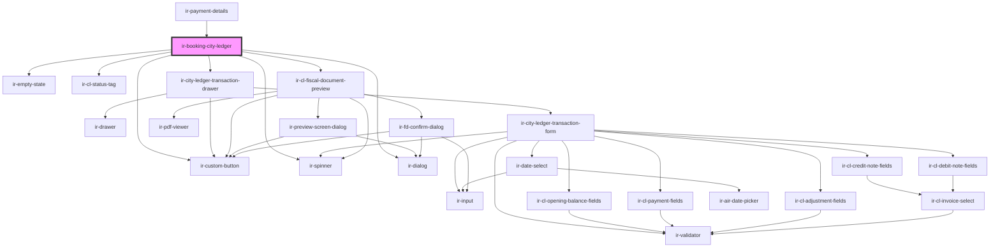

# ir-booking-city-ledger

<!-- Auto Generated Below -->

## Properties

| Property        | Attribute    | Description                                                     | Type         | Default     |
| --------------- | ------------ | --------------------------------------------------------------- | ------------ | ----------- |
| `booking`       | --           | Booking object; component is hidden when booking.agent is null. | `Booking`    | `undefined` |
| `error`         | `error`      | Error message driven by the parent fetch.                       | `string`     | `null`      |
| `folioRows`     | --           | Folio rows fetched by the parent.                               | `FolioRow[]` | `[]`        |
| `isLoading`     | `is-loading` | Loading state driven by the parent fetch.                       | `boolean`    | `false`     |
| `language`      | `language`   | Active language code.                                           | `string`     | `'en'`      |
| `svcCategories` | --           | Service-category entries used to populate the transaction form. | `IEntries[]` | `[]`        |

## Dependencies

### Used by

 - [ir-payment-details](../ir-payment-details)

### Depends on

- [ir-empty-state](../../ir-empty-state)
- [ir-cl-status-tag](../../ir-city-ledger/ir-cl-status-tag)
- [ir-custom-button](../../ui/ir-custom-button)
- [ir-spinner](../../ui/ir-spinner)
- [ir-city-ledger-transaction-drawer](../../ir-city-ledger/ir-city-ledger-folio/ir-city-ledger-transaction-drawer)
- [ir-cl-fiscal-document-preview](../../ir-city-ledger/ir-city-ledger-fiscal-documents/ir-cl-fiscal-document-preview)
- [ir-dialog](../../ui/ir-dialog)

### Graph

----------------------------------------------

*Built with [StencilJS](https://stenciljs.com/)*
