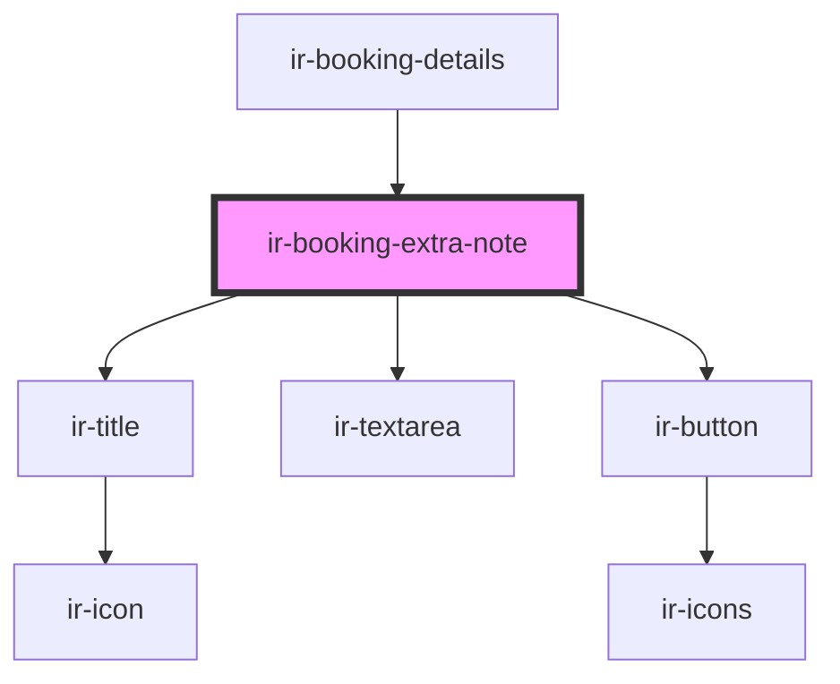

# ir-booking-extra-note

<!-- Auto Generated Below -->

## Properties

| Property  | Attribute | Description | Type      | Default     |
| --------- | --------- | ----------- | --------- | ----------- |
| `booking` | --        |             | `Booking` | `undefined` |

## Events

| Event          | Description | Type                   |
| -------------- | ----------- | ---------------------- |
| `closeModal`   |             | `CustomEvent<null>`    |
| `resetbooking` |             | `CustomEvent<Booking>` |

## Dependencies

### Used by

 - [ir-booking-details](..)

### Depends on

- [ir-title](../../ir-title)
- [ir-textarea](../../ir-textarea)
- [ir-button](../../ir-button)

### Graph

----------------------------------------------

*Built with [StencilJS](https://stenciljs.com/)*
