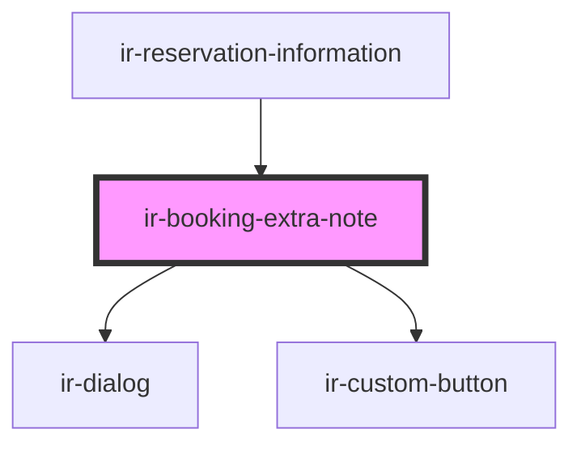

# ir-booking-extra-note

<!-- Auto Generated Below -->

## Properties

| Property  | Attribute | Description | Type      | Default     |
| --------- | --------- | ----------- | --------- | ----------- |
| `booking` | --        |             | `Booking` | `undefined` |
| `open`    | `open`    |             | `boolean` | `undefined` |

## Events

| Event             | Description | Type                   |
| ----------------- | ----------- | ---------------------- |
| `closeModal`      |             | `CustomEvent<null>`    |
| `resetBookingEvt` |             | `CustomEvent<Booking>` |

## Methods

### `closeDialog() => Promise<void>`

#### Returns

Type: `Promise<void>`

### `openDialog() => Promise<void>`

#### Returns

Type: `Promise<void>`

## Dependencies

### Used by

 - [ir-reservation-information](../ir-reservation-information)

### Depends on

- [ir-dialog](../../ui/ir-dialog)
- [ir-custom-button](../../ui/ir-custom-button)

### Graph

----------------------------------------------

*Built with [StencilJS](https://stenciljs.com/)*
