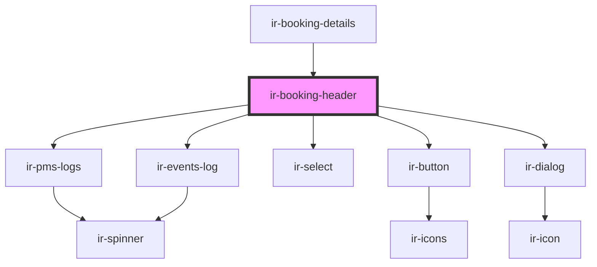

# ir-booking-header

<!-- Auto Generated Below -->

## Properties

| Property         | Attribute          | Description | Type      | Default     |
| ---------------- | ------------------ | ----------- | --------- | ----------- |
| `booking`        | --                 |             | `Booking` | `undefined` |
| `hasCloseButton` | `has-close-button` |             | `boolean` | `undefined` |
| `hasDelete`      | `has-delete`       |             | `boolean` | `undefined` |
| `hasMenu`        | `has-menu`         |             | `boolean` | `undefined` |
| `hasPrint`       | `has-print`        |             | `boolean` | `undefined` |
| `hasReceipt`     | `has-receipt`      |             | `boolean` | `undefined` |

## Events

| Event             | Description | Type                                                                                                 |
| ----------------- | ----------- | ---------------------------------------------------------------------------------------------------- |
| `closeSidebar`    |             | `CustomEvent<null>`                                                                                  |
| `openSidebar`     |             | `CustomEvent<{ type: BookingDetailsSidebarEvents; payload?: unknown; }>`                             |
| `resetBookingEvt` |             | `CustomEvent<null>`                                                                                  |
| `toast`           |             | `CustomEvent<ICustomToast & Partial<IToastWithButton> \| IDefaultToast & Partial<IToastWithButton>>` |

## Dependencies

### Used by

 - [ir-booking-details](..)

### Depends on

- [ir-pms-logs](ir-pms-logs)
- [ir-events-log](events-log)
- [ir-select](../../ui/ir-select)
- [ir-button](../../ui/ir-button)
- [ir-dialog](../../ui/ir-dialog)

### Graph

----------------------------------------------

*Built with [StencilJS](https://stenciljs.com/)*
