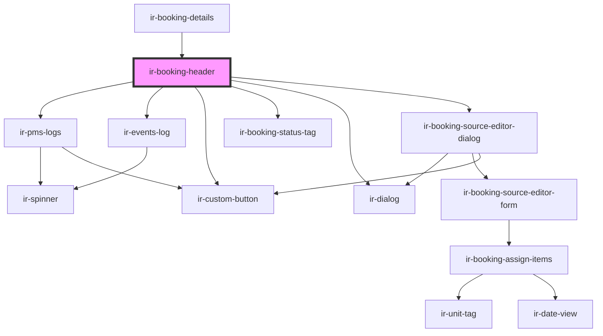

# ir-booking-header

<!-- Auto Generated Below -->

## Properties

| Property         | Attribute          | Description | Type                                                                                                                                                                                                                                                                                                                                                                                                                                                                                                                                                                                                                                                                                                                                                                              | Default     |
| ---------------- | ------------------ | ----------- | --------------------------------------------------------------------------------------------------------------------------------------------------------------------------------------------------------------------------------------------------------------------------------------------------------------------------------------------------------------------------------------------------------------------------------------------------------------------------------------------------------------------------------------------------------------------------------------------------------------------------------------------------------------------------------------------------------------------------------------------------------------------------------- | ----------- |
| `agent`          | --                 |             | `{ name?: string; id?: number; email?: string; property_id?: any; code?: string; address?: string; agent_rate_type_code?: { code?: string; description?: string; }; agent_type_code?: { code?: string; description?: string; }; city?: string; contact_name?: string; contract_nbr?: any; country_id?: number; currency_id?: any; due_balance?: any; email_copied_upon_booking?: string; is_active?: boolean; is_send_guest_confirmation_email?: boolean; notes?: string; payment_mode?: { code?: string; description?: string; }; phone?: string; provided_discount?: any; question?: string; sort_order?: any; tax_nbr?: string; reference?: string; verification_mode?: string; has_opening_balance?: boolean; cl_post_timing?: { code?: string; description?: string; }; }`   | `undefined` |
| `agents`         | --                 |             | `{ name?: string; id?: number; email?: string; property_id?: any; code?: string; address?: string; agent_rate_type_code?: { code?: string; description?: string; }; agent_type_code?: { code?: string; description?: string; }; city?: string; contact_name?: string; contract_nbr?: any; country_id?: number; currency_id?: any; due_balance?: any; email_copied_upon_booking?: string; is_active?: boolean; is_send_guest_confirmation_email?: boolean; notes?: string; payment_mode?: { code?: string; description?: string; }; phone?: string; provided_discount?: any; question?: string; sort_order?: any; tax_nbr?: string; reference?: string; verification_mode?: string; has_opening_balance?: boolean; cl_post_timing?: { code?: string; description?: string; }; }[]` | `[]`        |
| `booking`        | --                 |             | `Booking`                                                                                                                                                                                                                                                                                                                                                                                                                                                                                                                                                                                                                                                                                                                                                                         | `undefined` |
| `folioRows`      | --                 |             | `FolioRow[]`                                                                                                                                                                                                                                                                                                                                                                                                                                                                                                                                                                                                                                                                                                                                                                      | `[]`        |
| `hasCloseButton` | `has-close-button` |             | `boolean`                                                                                                                                                                                                                                                                                                                                                                                                                                                                                                                                                                                                                                                                                                                                                                         | `undefined` |
| `hasDelete`      | `has-delete`       |             | `boolean`                                                                                                                                                                                                                                                                                                                                                                                                                                                                                                                                                                                                                                                                                                                                                                         | `undefined` |
| `hasEmail`       | `has-email`        |             | `boolean`                                                                                                                                                                                                                                                                                                                                                                                                                                                                                                                                                                                                                                                                                                                                                                         | `true`      |
| `hasMenu`        | `has-menu`         |             | `boolean`                                                                                                                                                                                                                                                                                                                                                                                                                                                                                                                                                                                                                                                                                                                                                                         | `undefined` |
| `hasPrint`       | `has-print`        |             | `boolean`                                                                                                                                                                                                                                                                                                                                                                                                                                                                                                                                                                                                                                                                                                                                                                         | `undefined` |
| `hasReceipt`     | `has-receipt`      |             | `boolean`                                                                                                                                                                                                                                                                                                                                                                                                                                                                                                                                                                                                                                                                                                                                                                         | `undefined` |

## Events

| Event             | Description | Type                |
| ----------------- | ----------- | ------------------- |
| `closeSidebar`    |             | `CustomEvent<null>` |
| `openSidebar`     |             | `CustomEvent<any>`  |
| `resetBookingEvt` |             | `CustomEvent<null>` |

## Dependencies

### Used by

 - [ir-booking-details](..)

### Depends on

- [ir-pms-logs](ir-pms-logs)
- [ir-events-log](events-log)
- [ir-custom-button](../../ui/ir-custom-button)
- [ir-booking-status-tag](../../ui/ir-booking-status-tag)
- [ir-dialog](../../ui/ir-dialog)
- [ir-booking-source-editor-dialog](../ir-booking-source-editor-dialog)

### Graph

```mermaid
graph TD;
  ir-booking-header --> ir-pms-logs
  ir-booking-header --> ir-events-log
  ir-booking-header --> ir-custom-button
  ir-booking-header --> ir-booking-status-tag
  ir-booking-header --> ir-dialog
  ir-booking-header --> ir-booking-source-editor-dialog
  ir-pms-logs --> ir-spinner
  ir-pms-logs --> ir-custom-button
  ir-events-log --> ir-spinner
  ir-booking-source-editor-dialog --> ir-dialog
  ir-booking-source-editor-dialog --> ir-booking-source-editor-form
  ir-booking-source-editor-dialog --> ir-custom-button
  ir-booking-source-editor-form --> ir-booking-assign-items
  ir-booking-assign-items --> ir-unit-tag
  ir-booking-assign-items --> ir-date-view
  ir-booking-details --> ir-booking-header
  style ir-booking-header fill:#f9f,stroke:#333,stroke-width:4px
```

----------------------------------------------

*Built with [StencilJS](https://stenciljs.com/)*
