# ir-booking-rooms

<!-- Auto Generated Below -->

## Properties

| Property         | Attribute         | Description                                                                                                        | Type                                                                                                                                                                                                                                                                                                                                                                                                                                                                                                                                                                                                                                                                                                                                                                                                                                                                                                                                                                                                                                                                                                                                                                                                                                                                                                                                                                                                                                                                                                                                                                                                                                                                                                                                                                                      | Default     |
| ---------------- | ----------------- | ------------------------------------------------------------------------------------------------------------------ | ----------------------------------------------------------------------------------------------------------------------------------------------------------------------------------------------------------------------------------------------------------------------------------------------------------------------------------------------------------------------------------------------------------------------------------------------------------------------------------------------------------------------------------------------------------------------------------------------------------------------------------------------------------------------------------------------------------------------------------------------------------------------------------------------------------------------------------------------------------------------------------------------------------------------------------------------------------------------------------------------------------------------------------------------------------------------------------------------------------------------------------------------------------------------------------------------------------------------------------------------------------------------------------------------------------------------------------------------------------------------------------------------------------------------------------------------------------------------------------------------------------------------------------------------------------------------------------------------------------------------------------------------------------------------------------------------------------------------------------------------------------------------------------------- | ----------- |
| `agent`          | --                |                                                                                                                    | `{ name?: string; id?: number; email?: string; property_id?: any; code?: string; address?: string; agent_rate_type_code?: { code?: string; description?: string; }; agent_type_code?: { code?: string; description?: string; }; city?: string; contact_name?: string; contract_nbr?: any; country_id?: number; currency_id?: any; due_balance?: any; email_copied_upon_booking?: string; is_active?: boolean; is_send_guest_confirmation_email?: boolean; notes?: string; payment_mode?: { code?: string; description?: string; }; phone?: string; provided_discount?: any; question?: string; sort_order?: any; tax_nbr?: string; reference?: string; verification_mode?: string; has_opening_balance?: boolean; cl_post_timing?: { code?: string; description?: string; }; }`                                                                                                                                                                                                                                                                                                                                                                                                                                                                                                                                                                                                                                                                                                                                                                                                                                                                                                                                                                                                           | `undefined` |
| `bedPreference`  | --                | Available bed preference options for the booking rooms. Used to populate bed selection inside each room component. | `IEntries[]`                                                                                                                                                                                                                                                                                                                                                                                                                                                                                                                                                                                                                                                                                                                                                                                                                                                                                                                                                                                                                                                                                                                                                                                                                                                                                                                                                                                                                                                                                                                                                                                                                                                                                                                                                                              | `[]`        |
| `booking`        | --                | The booking object containing reservation details, including rooms, status, currency, and edit permissions.        | `Booking`                                                                                                                                                                                                                                                                                                                                                                                                                                                                                                                                                                                                                                                                                                                                                                                                                                                                                                                                                                                                                                                                                                                                                                                                                                                                                                                                                                                                                                                                                                                                                                                                                                                                                                                                                                                 | `undefined` |
| `clTransactions` | --                |                                                                                                                    | `{ PR_ID?: number; ENTRY_DATE?: string; ENTRY_USER_ID?: number; OWNER_ID?: number; DOC_NUMBER?: string; CURRENCY_ID?: number; TOTAL_AMOUNT?: number; CREDIT?: number; DEBIT?: number; NET_AMOUNT?: number; TAX_AMOUNT?: number; FROM_DATE?: string; TO_DATE?: string; BOOK_NBR?: string; EXTERNAL_REF?: string; FD_ID?: number; BH_ID?: number; BSA_REF?: string; CATEGORY?: string; AGENT_BOOKING_NBR?: string; ADULTS_NBR?: number; CHILD_NBR?: number; INFANT_NBR?: number; GUEST_FIRST_NAME?: string; GUEST_LAST_NAME?: string; ROOM_CATEGORY_ID?: number; ROOM_TYPE_ID?: number; RATE_PLAN_ID?: number; SERVICE_DATE?: string; CITY_TAX_AMOUNT?: number; CITY_TAX_PERCENT?: number; CL_TX_ID?: number; CL_TX_TYPE_CODE?: string; DESCRIPTION?: string; IS_HOLD?: boolean; IS_LOCKED?: boolean; My_Bh?: any; My_Currency?: any; My_Fd?: { DOC_NUMBER?: string; FD_TYPE_CODE?: string; CURRENCY_ID?: number; TOTAL_AMOUNT?: number; CREDIT?: number; DEBIT?: number; NET_AMOUNT?: number; TAX_AMOUNT?: number; FROM_DATE?: string; TO_DATE?: string; BOOK_NBR?: string; AGENCY_ID?: number; AGENCY_NAME?: string; CREDIT_DISPLAY?: string; CURRENCY_CODE?: string; DEBIT_DISPLAY?: string; EXTERNAL_REF?: string; FD_ID?: number; FD_STATUS_CODE?: string; FD_STATUS_NAME?: string; FD_TYPE_NAME?: string; ISSUE_DATE?: string; ISSUE_DATE_DISPLAY?: string; IS_PRINTED?: boolean; NET_AMOUNT_DISPLAY?: string; TAX_AMOUNT_DISPLAY?: string; BALANCE_BEFORE_TX?: number; BALANCE_AFTER_TX?: number; }; My_Pr?: any; My_Room_category?: any; RUNNING_BALANCE?: number; My_Room_type?: any; My_Travel_agency?: null; PAY_METHOD_CODE?: string; REL_ENTITY?: "TBL_BSAD" \| "TBL_BSP"; REL_ENTITY_KEY?: number; TRAVEL_AGENCY_ID?: number; VAT_AMOUNT?: number; VAT_PERCENT?: number; }[]` | `[]`        |
| `departureTime`  | --                | Available departure time options for the booking. Passed down to each room when applicable.                        | `IEntries[]`                                                                                                                                                                                                                                                                                                                                                                                                                                                                                                                                                                                                                                                                                                                                                                                                                                                                                                                                                                                                                                                                                                                                                                                                                                                                                                                                                                                                                                                                                                                                                                                                                                                                                                                                                                              | `[]`        |
| `hasRoomAdd`     | `has-room-add`    | Enables the ability to add a new room/unit to the booking.                                                         | `boolean`                                                                                                                                                                                                                                                                                                                                                                                                                                                                                                                                                                                                                                                                                                                                                                                                                                                                                                                                                                                                                                                                                                                                                                                                                                                                                                                                                                                                                                                                                                                                                                                                                                                                                                                                                                                 | `false`     |
| `hasRoomDelete`  | `has-room-delete` | Enables deleting a room from the booking.                                                                          | `boolean`                                                                                                                                                                                                                                                                                                                                                                                                                                                                                                                                                                                                                                                                                                                                                                                                                                                                                                                                                                                                                                                                                                                                                                                                                                                                                                                                                                                                                                                                                                                                                                                                                                                                                                                                                                                 | `false`     |
| `hasRoomEdit`    | `has-room-edit`   | Enables editing room details within the booking.                                                                   | `boolean`                                                                                                                                                                                                                                                                                                                                                                                                                                                                                                                                                                                                                                                                                                                                                                                                                                                                                                                                                                                                                                                                                                                                                                                                                                                                                                                                                                                                                                                                                                                                                                                                                                                                                                                                                                                 | `false`     |
| `language`       | `language`        | Active language code used for translations and formatting.                                                         | `string`                                                                                                                                                                                                                                                                                                                                                                                                                                                                                                                                                                                                                                                                                                                                                                                                                                                                                                                                                                                                                                                                                                                                                                                                                                                                                                                                                                                                                                                                                                                                                                                                                                                                                                                                                                                  | `undefined` |
| `legendData`     | --                | Legend metadata used for displaying room status indicators.                                                        | `unknown`                                                                                                                                                                                                                                                                                                                                                                                                                                                                                                                                                                                                                                                                                                                                                                                                                                                                                                                                                                                                                                                                                                                                                                                                                                                                                                                                                                                                                                                                                                                                                                                                                                                                                                                                                                                 | `undefined` |
| `propertyId`     | `property-id`     | The property identifier associated with the booking. Used when interacting with room-level operations.             | `number`                                                                                                                                                                                                                                                                                                                                                                                                                                                                                                                                                                                                                                                                                                                                                                                                                                                                                                                                                                                                                                                                                                                                                                                                                                                                                                                                                                                                                                                                                                                                                                                                                                                                                                                                                                                  | `undefined` |
| `roomsInfo`      | --                | Additional room metadata and configuration details.                                                                | `unknown`                                                                                                                                                                                                                                                                                                                                                                                                                                                                                                                                                                                                                                                                                                                                                                                                                                                                                                                                                                                                                                                                                                                                                                                                                                                                                                                                                                                                                                                                                                                                                                                                                                                                                                                                                                                 | `undefined` |
| `splitIndex`     | --                | Precomputed split index used to group split rooms together. If not provided, it will be generated internally.      | `{ parentOf: Map<string, string>; childrenOf: Map<string, string[]>; roleOf: Map<string, SplitRole>; chainOf: Map<string, string[]>; heads: string[]; }`                                                                                                                                                                                                                                                                                                                                                                                                                                                                                                                                                                                                                                                                                                                                                                                                                                                                                                                                                                                                                                                                                                                                                                                                                                                                                                                                                                                                                                                                                                                                                                                                                                  | `undefined` |

## Events

| Event                | Description | Type                  |
| -------------------- | ----------- | --------------------- |
| `roomDeleteFinished` |             | `CustomEvent<string>` |

## Dependencies

### Used by

 - [ir-booking-details](..)

### Depends on

- [ir-room](../ir-room)
- [ir-date-view](../../ir-date-view)
- [ir-custom-button](../../ui/ir-custom-button)

### Graph

```mermaid
graph TD;
  ir-booking-rooms --> ir-room
  ir-booking-rooms --> ir-date-view
  ir-booking-rooms --> ir-custom-button
  ir-room --> ir-custom-button
  ir-room --> ir-date-view
  ir-room --> ir-unit-tag
  ir-room --> ir-cl-status-tag
  ir-room --> ir-label
  ir-room --> ir-assignment-toggle-dialog
  ir-room --> ir-dialog
  ir-room --> ir-checkout-dialog
  ir-room --> ir-invoice
  ir-room --> ir-booking-pricing-drawer
  ir-room --> ir-hb-preference-dialog
  ir-assignment-toggle-dialog --> ir-dialog
  ir-assignment-toggle-dialog --> ir-custom-button
  ir-checkout-dialog --> ir-input
  ir-checkout-dialog --> ir-dialog
  ir-checkout-dialog --> ir-spinner
  ir-checkout-dialog --> ir-custom-button
  ir-checkout-dialog --> ir-payment-folio
  ir-payment-folio --> ir-drawer
  ir-payment-folio --> ir-payment-folio-form
  ir-payment-folio --> ir-custom-button
  ir-payment-folio-form --> ir-date-select
  ir-payment-folio-form --> ir-validator
  ir-payment-folio-form --> ir-input
  ir-date-select --> ir-input
  ir-date-select --> ir-air-date-picker
  ir-invoice --> ir-drawer
  ir-invoice --> ir-invoice-form
  ir-invoice --> ir-custom-button
  ir-invoice --> ir-fiscal-document-preview
  ir-invoice-form --> ir-spinner
  ir-invoice-form --> ir-date-select
  ir-invoice-form --> ir-booking-billing-recipient
  ir-invoice-form --> ir-empty-state
  ir-booking-billing-recipient --> ir-booking-company-dialog
  ir-booking-company-dialog --> ir-dialog
  ir-booking-company-dialog --> ir-booking-company-form
  ir-booking-company-dialog --> ir-custom-button
  ir-booking-company-form --> ir-input
  ir-fiscal-document-preview --> ir-cl-fiscal-document-preview
  ir-fiscal-document-preview --> ir-guest-document-preview
  ir-cl-fiscal-document-preview --> ir-spinner
  ir-cl-fiscal-document-preview --> ir-pdf-viewer
  ir-cl-fiscal-document-preview --> ir-preview-screen-dialog
  ir-cl-fiscal-document-preview --> ir-custom-button
  ir-cl-fiscal-document-preview --> ir-fd-confirm-dialog
  ir-preview-screen-dialog --> ir-dialog
  ir-preview-screen-dialog --> ir-custom-button
  ir-fd-confirm-dialog --> ir-dialog
  ir-fd-confirm-dialog --> ir-input
  ir-fd-confirm-dialog --> ir-custom-button
  ir-guest-document-preview --> ir-pdf-viewer
  ir-guest-document-preview --> ir-spinner
  ir-guest-document-preview --> ir-preview-screen-dialog
  ir-guest-document-preview --> ir-custom-button
  ir-booking-pricing-drawer --> ir-drawer
  ir-booking-pricing-drawer --> ir-booking-pricing-form
  ir-booking-pricing-drawer --> ir-custom-button
  ir-booking-pricing-form --> ir-spinner
  ir-booking-pricing-form --> ir-validator
  ir-booking-pricing-form --> ir-input
  ir-hb-preference-dialog --> ir-dialog
  ir-hb-preference-dialog --> ir-custom-button
  ir-booking-details --> ir-booking-rooms
  style ir-booking-rooms fill:#f9f,stroke:#333,stroke-width:4px
```

----------------------------------------------

*Built with [StencilJS](https://stenciljs.com/)*
