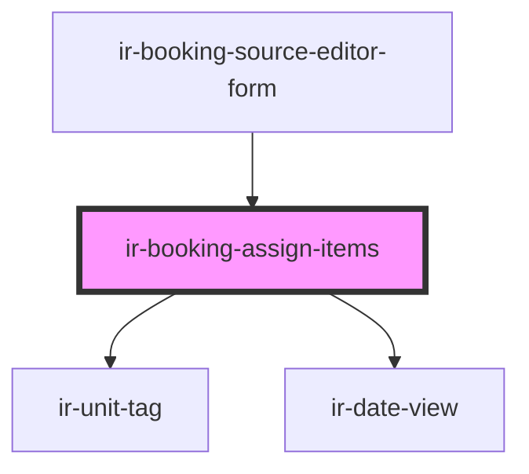

# ir-booking-assign-items

<!-- Auto Generated Below -->

## Properties

| Property | Attribute | Description | Type               | Default |
| -------- | --------- | ----------- | ------------------ | ------- |
| `items`  | --        |             | `AssignableItem[]` | `[]`    |

## Events

| Event                    | Description | Type                       |
| ------------------------ | ----------- | -------------------------- |
| `bookingSelectionChange` |             | `CustomEvent<Set<string>>` |

## Dependencies

### Used by

 - [ir-booking-source-editor-form](../ir-booking-source-editor-form)

### Depends on

- [ir-unit-tag](../../../ir-unit-tag)
- [ir-date-view](../../../ir-date-view)

### Graph

----------------------------------------------

*Built with [StencilJS](https://stenciljs.com/)*
