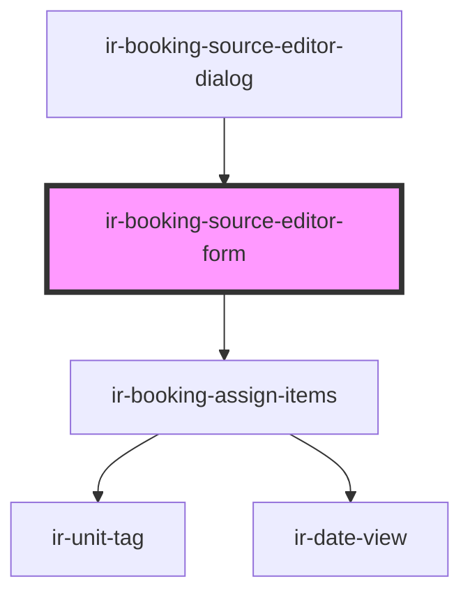

# ir-booking-source-editor-form

<!-- Auto Generated Below -->

## Properties

| Property  | Attribute | Description | Type      | Default     |
| --------- | --------- | ----------- | --------- | ----------- |
| `booking` | --        |             | `Booking` | `undefined` |

## Events

| Event                | Description | Type                   |
| -------------------- | ----------- | ---------------------- |
| `bookingSourceSaved` |             | `CustomEvent<null>`    |
| `loadingChange`      |             | `CustomEvent<boolean>` |

## Dependencies

### Used by

 - [ir-booking-source-editor-dialog](..)

### Depends on

- [ir-booking-assign-items](../ir-booking-assign-items)

### Graph

----------------------------------------------

*Built with [StencilJS](https://stenciljs.com/)*
