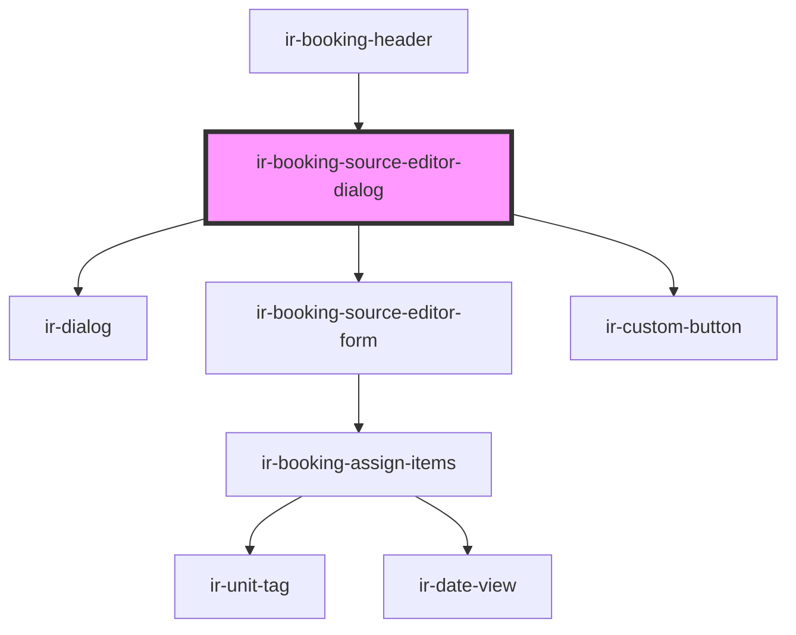

# ir-booking-source-editor

<!-- Auto Generated Below -->

## Properties

| Property  | Attribute | Description | Type      | Default     |
| --------- | --------- | ----------- | --------- | ----------- |
| `booking` | --        |             | `Booking` | `undefined` |

## Events

| Event             | Description | Type                |
| ----------------- | ----------- | ------------------- |
| `resetBookingEvt` |             | `CustomEvent<null>` |

## Methods

### `closeDialog() => Promise<void>`

#### Returns

Type: `Promise<void>`

### `openDialog() => Promise<void>`

#### Returns

Type: `Promise<void>`

## Dependencies

### Used by

 - [ir-booking-header](../ir-booking-header)

### Depends on

- [ir-dialog](../../ui/ir-dialog)
- [ir-booking-source-editor-form](ir-booking-source-editor-form)
- [ir-custom-button](../../ui/ir-custom-button)

### Graph

----------------------------------------------

*Built with [StencilJS](https://stenciljs.com/)*
