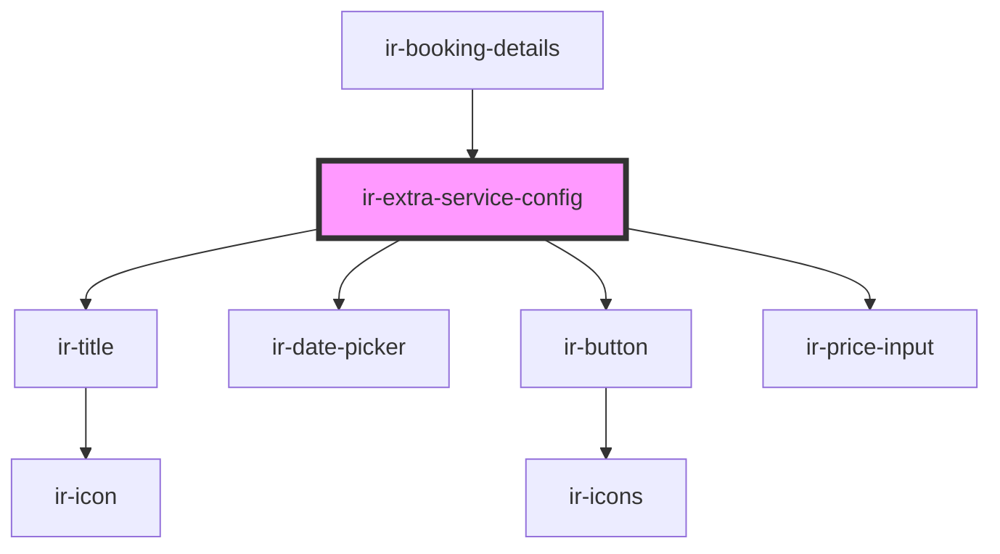

# ir-extra-service-config

<!-- Auto Generated Below -->

## Properties

| Property  | Attribute | Description | Type                                                                                                                                                                     | Default     |
| --------- | --------- | ----------- | ------------------------------------------------------------------------------------------------------------------------------------------------------------------------ | ----------- |
| `booking` | --        |             | `{ from_date: string; to_date: string; currency: Currency; booking_nbr: string; }`                                                                                       | `undefined` |
| `service` | --        |             | `{ description?: string; cost?: number; booking_system_id?: number; currency_id?: number; end_date?: string; price?: number; start_date?: string; system_id?: number; }` | `undefined` |

## Events

| Event             | Description | Type                |
| ----------------- | ----------- | ------------------- |
| `closeModal`      |             | `CustomEvent<null>` |
| `resetBookingEvt` |             | `CustomEvent<null>` |

## Dependencies

### Used by

 - [ir-booking-details](../..)

### Depends on

- [ir-title](../../../ir-title)
- [ir-date-picker](../../../ui/ir-date-picker)
- [ir-button](../../../ui/ir-button)
- [ir-price-input](../../../ui/ir-price-input)

### Graph

----------------------------------------------

*Built with [StencilJS](https://stenciljs.com/)*
