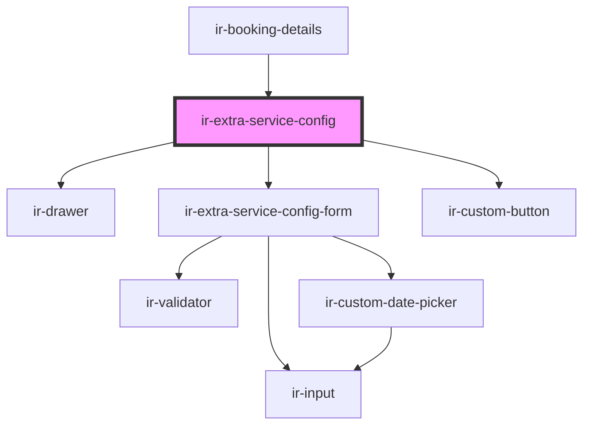

# ir-extra-service-config

<!-- Auto Generated Below -->

## Properties

| Property  | Attribute | Description | Type                                                                                                                                                                     | Default     |
| --------- | --------- | ----------- | ------------------------------------------------------------------------------------------------------------------------------------------------------------------------ | ----------- |
| `booking` | --        |             | `{ currency: Currency; from_date: string; to_date: string; booking_nbr: string; }`                                                                                       | `undefined` |
| `open`    | `open`    |             | `boolean`                                                                                                                                                                | `undefined` |
| `service` | --        |             | `{ system_id?: number; cost?: number; description?: string; booking_system_id?: number; currency_id?: number; end_date?: string; start_date?: string; price?: number; }` | `undefined` |

## Events

| Event        | Description | Type                |
| ------------ | ----------- | ------------------- |
| `closeModal` |             | `CustomEvent<null>` |

## Dependencies

### Used by

 - [ir-booking-details](../..)

### Depends on

- [ir-drawer](../../../ir-drawer)
- [ir-extra-service-config-form](ir-extra-service-config-form)
- [ir-custom-button](../../../ui/ir-custom-button)

### Graph

----------------------------------------------

*Built with [StencilJS](https://stenciljs.com/)*
