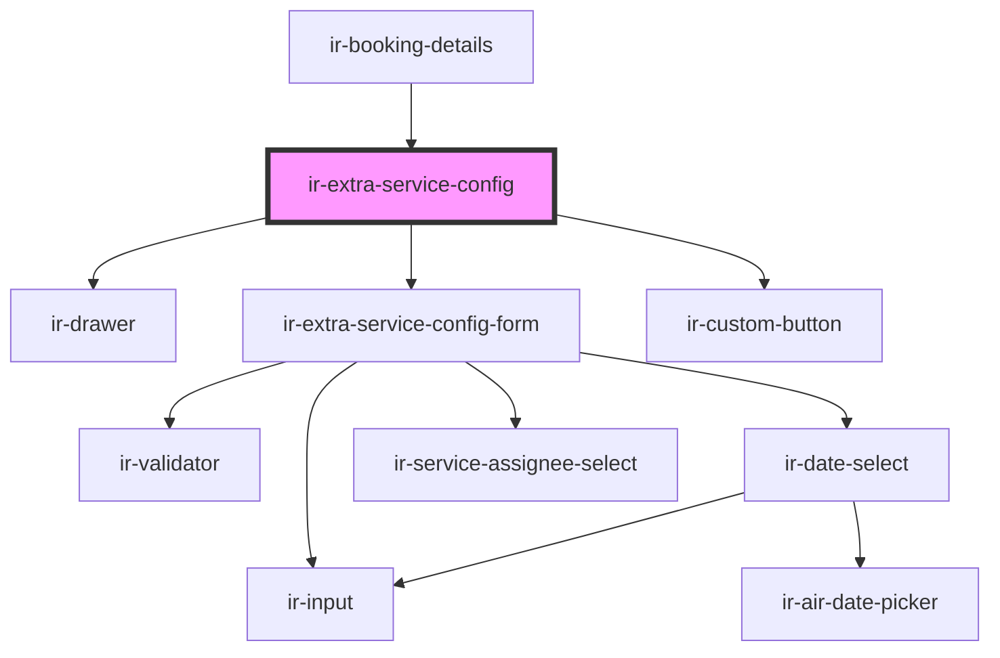

# ir-extra-service-config

<!-- Auto Generated Below -->

## Properties

| Property        | Attribute  | Description | Type                                                                                                                                                                                                                                                                                                                                                                                                                                                                                                                                                                                                                                                                                                                                                                                                                                                                                                                                                                                                                                                                                                                                                                                                                                            | Default     |
| --------------- | ---------- | ----------- | ----------------------------------------------------------------------------------------------------------------------------------------------------------------------------------------------------------------------------------------------------------------------------------------------------------------------------------------------------------------------------------------------------------------------------------------------------------------------------------------------------------------------------------------------------------------------------------------------------------------------------------------------------------------------------------------------------------------------------------------------------------------------------------------------------------------------------------------------------------------------------------------------------------------------------------------------------------------------------------------------------------------------------------------------------------------------------------------------------------------------------------------------------------------------------------------------------------------------------------------------- | ----------- |
| `agent`         | --         |             | `{ name?: string; email?: string; property_id?: any; code?: string; id?: number; address?: string; agent_rate_type_code?: { code?: string; description?: string; }; agent_type_code?: { code?: string; description?: string; }; city?: string; contact_name?: string; contract_nbr?: any; country_id?: number; currency_id?: any; due_balance?: any; email_copied_upon_booking?: string; is_active?: boolean; is_send_guest_confirmation_email?: boolean; notes?: string; payment_mode?: { code?: string; description?: string; }; phone?: string; provided_discount?: any; question?: string; sort_order?: any; tax_nbr?: string; reference?: string; verification_mode?: string; has_opening_balance?: boolean; cl_post_timing?: { code?: string; description?: string; }; }`                                                                                                                                                                                                                                                                                                                                                                                                                                                                 | `undefined` |
| `booking`       | --         |             | `Booking`                                                                                                                                                                                                                                                                                                                                                                                                                                                                                                                                                                                                                                                                                                                                                                                                                                                                                                                                                                                                                                                                                                                                                                                                                                       | `undefined` |
| `language`      | `language` |             | `string`                                                                                                                                                                                                                                                                                                                                                                                                                                                                                                                                                                                                                                                                                                                                                                                                                                                                                                                                                                                                                                                                                                                                                                                                                                        | `undefined` |
| `open`          | `open`     |             | `boolean`                                                                                                                                                                                                                                                                                                                                                                                                                                                                                                                                                                                                                                                                                                                                                                                                                                                                                                                                                                                                                                                                                                                                                                                                                                       | `undefined` |
| `service`       | --         |             | `{ description?: string; currency_id?: number; agent?: { name?: string; email?: string; property_id?: any; code?: string; id?: number; address?: string; agent_rate_type_code?: { code?: string; description?: string; }; agent_type_code?: { code?: string; description?: string; }; city?: string; contact_name?: string; contract_nbr?: any; country_id?: number; currency_id?: any; due_balance?: any; email_copied_upon_booking?: string; is_active?: boolean; is_send_guest_confirmation_email?: boolean; notes?: string; payment_mode?: { code?: string; description?: string; }; phone?: string; provided_discount?: any; question?: string; sort_order?: any; tax_nbr?: string; reference?: string; verification_mode?: string; has_opening_balance?: boolean; cl_post_timing?: { code?: string; description?: string; }; }; system_id?: number; booking_system_id?: number; cost?: number; end_date?: string; start_date?: string; price?: number; category?: { code?: string; }; charges?: { city_tax_amount?: number; city_tax_percent?: number; net_amount?: number; service_charge_amount?: number; service_charge_percent?: number; tax_amount?: number; total_amount?: number; vat_amount?: number; vat_percent?: number; }; }` | `undefined` |
| `svcCategories` | --         |             | `IEntries[]`                                                                                                                                                                                                                                                                                                                                                                                                                                                                                                                                                                                                                                                                                                                                                                                                                                                                                                                                                                                                                                                                                                                                                                                                                                    | `[]`        |

## Events

| Event        | Description | Type                |
| ------------ | ----------- | ------------------- |
| `closeModal` |             | `CustomEvent<null>` |

## Dependencies

### Used by

 - [ir-booking-details](../..)

### Depends on

- [ir-drawer](../../../ir-drawer)
- [ir-extra-service-config-form](ir-extra-service-config-form)
- [ir-custom-button](../../../ui/ir-custom-button)

### Graph

```mermaid
graph TD;
  ir-extra-service-config --> ir-drawer
  ir-extra-service-config --> ir-extra-service-config-form
  ir-extra-service-config --> ir-custom-button
  ir-extra-service-config-form --> ir-validator
  ir-extra-service-config-form --> ir-date-select
  ir-extra-service-config-form --> ir-input
  ir-extra-service-config-form --> ir-service-assignee-select
  ir-date-select --> ir-input
  ir-date-select --> ir-air-date-picker
  ir-booking-details --> ir-extra-service-config
  style ir-extra-service-config fill:#f9f,stroke:#333,stroke-width:4px
```

----------------------------------------------

*Built with [StencilJS](https://stenciljs.com/)*
