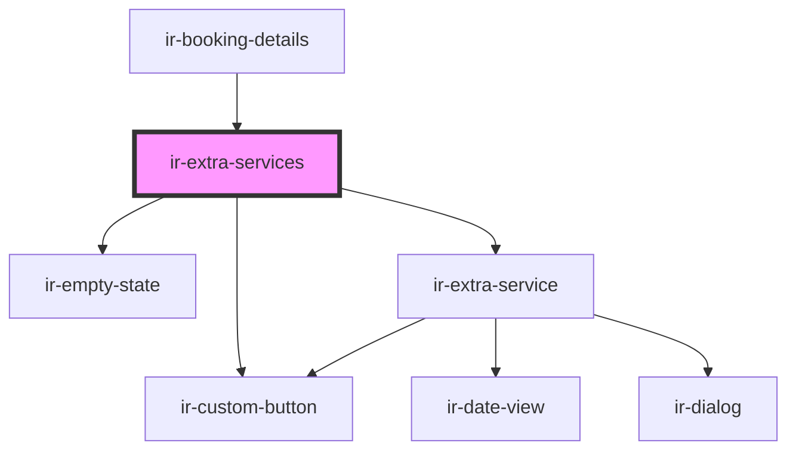

# ir-extra-services

<!-- Auto Generated Below -->

## Properties

| Property  | Attribute | Description | Type                                                                                                                                                                                                                                     | Default     |
| --------- | --------- | ----------- | ---------------------------------------------------------------------------------------------------------------------------------------------------------------------------------------------------------------------------------------- | ----------- |
| `booking` | --        |             | `{ currency: Currency; booking_nbr: string; extra_services: { system_id?: number; cost?: number; description?: string; booking_system_id?: number; currency_id?: number; end_date?: string; start_date?: string; price?: number; }[]; }` | `undefined` |

## Dependencies

### Used by

 - [ir-booking-details](..)

### Depends on

- [ir-custom-button](../../ui/ir-custom-button)
- [ir-empty-state](../../ir-empty-state)
- [ir-extra-service](ir-extra-service)

### Graph

----------------------------------------------

*Built with [StencilJS](https://stenciljs.com/)*
