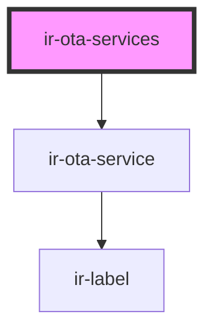

# ir-ota-services

<!-- Auto Generated Below -->

## Properties

| Property   | Attribute | Description | Type           | Default |
| ---------- | --------- | ----------- | -------------- | ------- |
| `services` | --        |             | `OtaService[]` | `[]`    |

## Dependencies

### Depends on

- [ir-ota-service](ir-ota-service)

### Graph

----------------------------------------------

*Built with [StencilJS](https://stenciljs.com/)*
