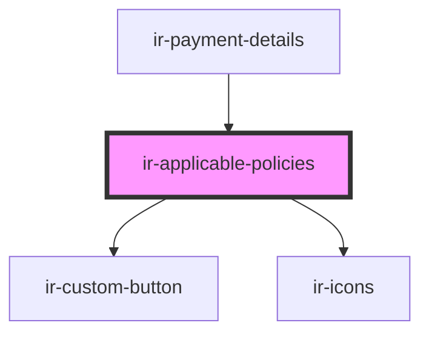

# ir-applicable-policies

<!-- Auto Generated Below -->

## Properties

| Property     | Attribute     | Description | Type      | Default     |
| ------------ | ------------- | ----------- | --------- | ----------- |
| `booking`    | --            |             | `Booking` | `undefined` |
| `language`   | `language`    |             | `string`  | `'en'`      |
| `propertyId` | `property-id` |             | `number`  | `undefined` |

## Events

| Event             | Description | Type                          |
| ----------------- | ----------- | ----------------------------- |
| `generatePayment` |             | `CustomEvent<IPaymentAction>` |

## Dependencies

### Used by

 - [ir-payment-details](..)

### Depends on

- [ir-custom-button](../../../ui/ir-custom-button)
- [ir-icons](../../../ui/ir-icons)

### Graph

----------------------------------------------

*Built with [StencilJS](https://stenciljs.com/)*
