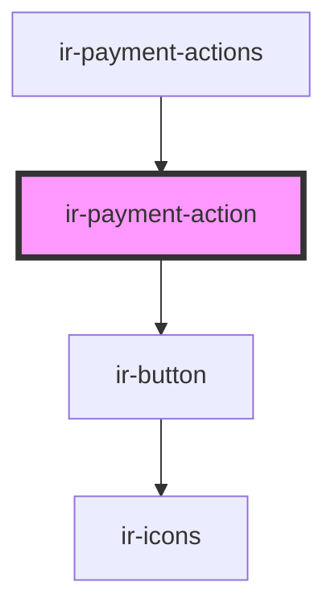

# ir-payment-action

<!-- Auto Generated Below -->

## Properties

| Property        | Attribute | Description | Type             | Default     |
| --------------- | --------- | ----------- | ---------------- | ----------- |
| `paymentAction` | --        |             | `IPaymentAction` | `undefined` |

## Events

| Event             | Description | Type                          |
| ----------------- | ----------- | ----------------------------- |
| `generatePayment` |             | `CustomEvent<IPaymentAction>` |

## Dependencies

### Used by

 - [ir-payment-actions](..)

### Depends on

- [ir-button](../../../../ui/ir-button)

### Graph

----------------------------------------------

*Built with [StencilJS](https://stenciljs.com/)*
