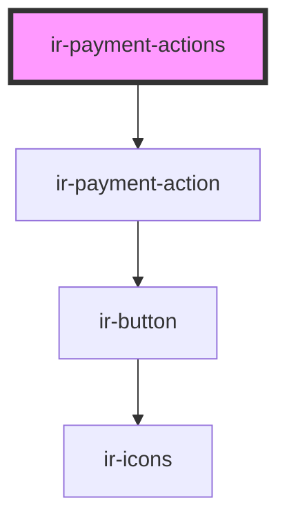

# ir-payment-actions

<!-- Auto Generated Below -->

## Properties

| Property        | Attribute | Description | Type               | Default     |
| --------------- | --------- | ----------- | ------------------ | ----------- |
| `booking`       | --        |             | `Booking`          | `undefined` |
| `paymentAction` | --        |             | `IPaymentAction[]` | `undefined` |

## Dependencies

### Depends on

- [ir-payment-action](ir-payment-action)

### Graph

----------------------------------------------

*Built with [StencilJS](https://stenciljs.com/)*
