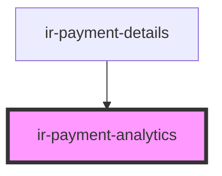

# ir-payment-analytics

<!-- Auto Generated Below -->

## Properties

| Property                   | Attribute                     | Description | Type      | Default     |
| -------------------------- | ----------------------------- | ----------- | --------- | ----------- |
| `booking`                  | --                            |             | `Booking` | `undefined` |
| `directBookingGrossAmount` | `direct-booking-gross-amount` |             | `number`  | `null`      |
| `loading`                  | `loading`                     |             | `boolean` | `false`     |
| `optimBaseGrossAmount`     | `optim-base-gross-amount`     |             | `number`  | `null`      |

## Dependencies

### Used by

 - [ir-payment-details](..)

### Graph

----------------------------------------------

*Built with [StencilJS](https://stenciljs.com/)*
