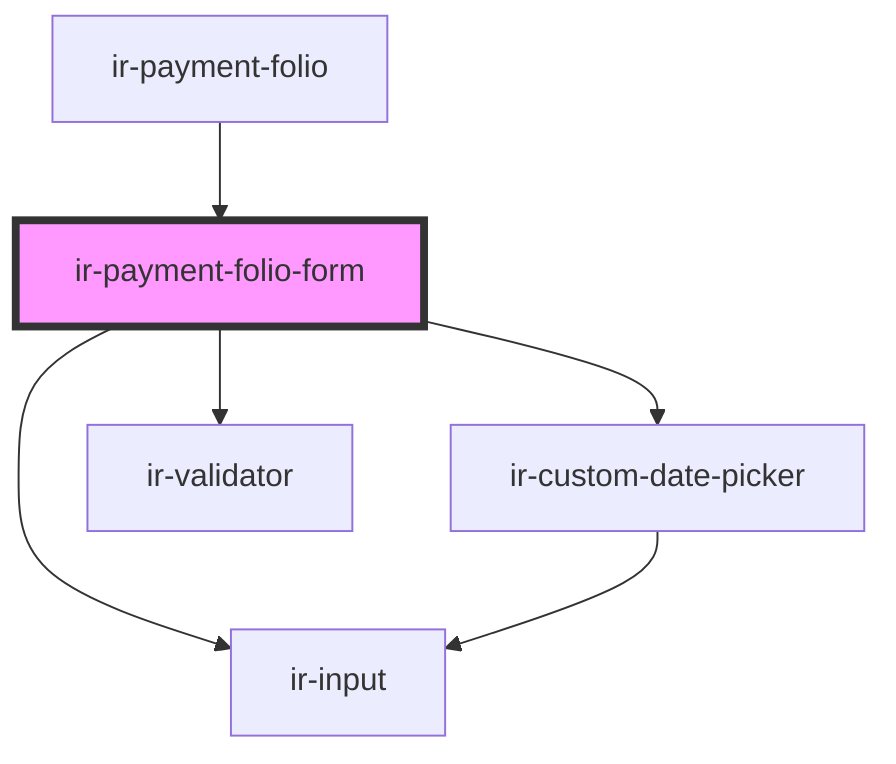

# ir-payment-folio-form

<!-- Auto Generated Below -->

## Properties

| Property         | Attribute        | Description | Type                                                                                                                                                                                                                                                                                            | Default                                                                                                                                         |
| ---------------- | ---------------- | ----------- | ----------------------------------------------------------------------------------------------------------------------------------------------------------------------------------------------------------------------------------------------------------------------------------------------- | ----------------------------------------------------------------------------------------------------------------------------------------------- |
| `bookingNumber`  | `booking-number` |             | `string`                                                                                                                                                                                                                                                                                        | `undefined`                                                                                                                                     |
| `formId`         | `form-id`        |             | `string`                                                                                                                                                                                                                                                                                        | `undefined`                                                                                                                                     |
| `mode`           | `mode`           |             | `"edit" \| "new" \| "payment-action"`                                                                                                                                                                                                                                                           | `undefined`                                                                                                                                     |
| `payment`        | --               |             | `{ system_id?: number; id: number; date: string; amount: number; currency: ICurrency; designation: string; reference: string; book_nbr?: string; payment_gateway_code?: number; payment_type?: PaymentType; payment_method?: PaymentType; receipt_nbr?: string; is_receipt_issued?: boolean; }` | `{     date: moment().format(DATE_FORMAT),     amount: 0,     designation: undefined,     currency: null,     reference: null,     id: -1,   }` |
| `paymentEntries` | --               |             | `{ types: IEntries[]; groups: IEntries[]; methods: IEntries[]; }`                                                                                                                                                                                                                               | `undefined`                                                                                                                                     |

## Events

| Event                               | Description | Type                                    |
| ----------------------------------- | ----------- | --------------------------------------- |
| `closeModal`                        |             | `CustomEvent<null>`                     |
| `loadingChanged`                    |             | `CustomEvent<"save" \| "save-print">`   |
| `resetBookingEvt`                   |             | `CustomEvent<null>`                     |
| `resetExposedCancellationDueAmount` |             | `CustomEvent<{ booking_nbr: string; }>` |

## Dependencies

### Used by

 - [ir-payment-folio](..)

### Depends on

- [ir-custom-date-picker](../../../../ir-custom-date-picker)
- [ir-validator](../../../../ui/ir-validator)
- [ir-input](../../../../ui/ir-input)

### Graph

----------------------------------------------

*Built with [StencilJS](https://stenciljs.com/)*
