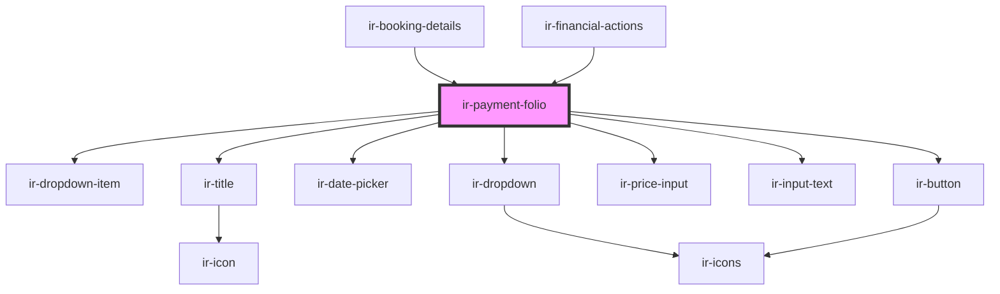

# ir-payment-folio

<!-- Auto Generated Below -->

## Properties

| Property         | Attribute        | Description | Type                                                                                                                                                                                                                     | Default                                                                                                                                          |
| ---------------- | ---------------- | ----------- | ------------------------------------------------------------------------------------------------------------------------------------------------------------------------------------------------------------------------ | ------------------------------------------------------------------------------------------------------------------------------------------------ |
| `bookingNumber`  | `booking-number` |             | `string`                                                                                                                                                                                                                 | `undefined`                                                                                                                                      |
| `mode`           | `mode`           |             | `"edit" \| "new" \| "payment-action"`                                                                                                                                                                                    | `undefined`                                                                                                                                      |
| `payment`        | --               |             | `{ id: number; date: string; amount: number; currency: ICurrency; designation: string; reference: string; book_nbr?: string; payment_gateway_code?: number; payment_type?: PaymentType; payment_method?: PaymentType; }` | `{     date: moment().format('YYYY-MM-DD'),     amount: 0,     designation: undefined,     currency: null,     reference: null,     id: -1,   }` |
| `paymentEntries` | --               |             | `{ types: IEntries[]; groups: IEntries[]; methods: IEntries[]; }`                                                                                                                                                        | `undefined`                                                                                                                                      |

## Events

| Event                               | Description | Type                |
| ----------------------------------- | ----------- | ------------------- |
| `closeModal`                        |             | `CustomEvent<null>` |
| `resetBookingEvt`                   |             | `CustomEvent<null>` |
| `resetExposedCancellationDueAmount` |             | `CustomEvent<null>` |

## Dependencies

### Used by

 - [ir-booking-details](../..)
 - [ir-financial-actions](../../../ir-financial-actions)

### Depends on

- [ir-dropdown-item](../../../ui/ir-dropdown-item)
- [ir-title](../../../ir-title)
- [ir-date-picker](../../../ui/ir-date-picker)
- [ir-dropdown](../../../ui/ir-dropdown)
- [ir-price-input](../../../ui/ir-price-input)
- [ir-input-text](../../../ui/ir-input-text)
- [ir-button](../../../ui/ir-button)

### Graph

----------------------------------------------

*Built with [StencilJS](https://stenciljs.com/)*
