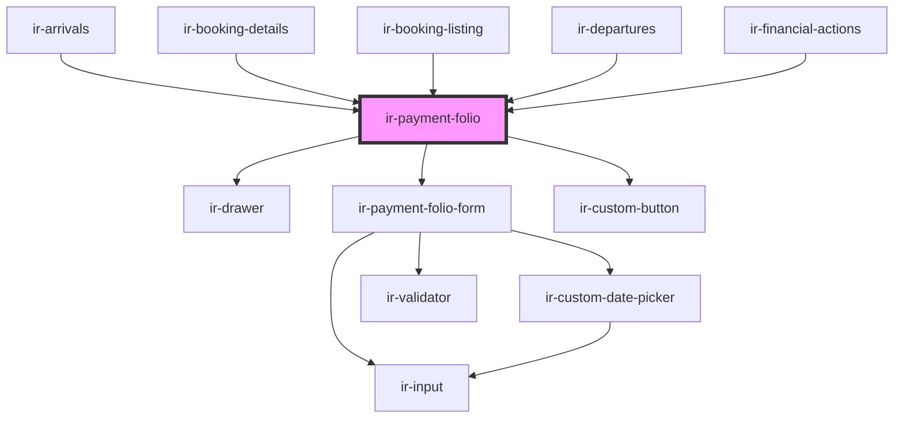

# ir-payment-folio

<!-- Auto Generated Below -->

## Properties

| Property         | Attribute        | Description                                                                                                                                                                                                        | Type                                                                                                                                                                                                                                                                                            | Default                                                                                                                                         |
| ---------------- | ---------------- | ------------------------------------------------------------------------------------------------------------------------------------------------------------------------------------------------------------------ | ----------------------------------------------------------------------------------------------------------------------------------------------------------------------------------------------------------------------------------------------------------------------------------------------- | ----------------------------------------------------------------------------------------------------------------------------------------------- |
| `bookingNumber`  | `booking-number` | The booking reference number associated with this folio operation. Passed down to the folio form so the payment entry is linked to the correct reservation when saving.                                            | `string`                                                                                                                                                                                                                                                                                        | `undefined`                                                                                                                                     |
| `mode`           | `mode`           | Determines how the folio entry should behave or be displayed. Typical modes include creating a new entry, editing an existing one, or other folio-specific workflows.                                              | `"edit" \| "new" \| "payment-action"`                                                                                                                                                                                                                                                           | `undefined`                                                                                                                                     |
| `payment`        | --               | The payment or folio entry being created or edited. Defaults to a new empty payment object when the component is used for creating a new entry.                                                                    | `{ system_id?: number; id: number; date: string; amount: number; currency: ICurrency; designation: string; reference: string; book_nbr?: string; payment_gateway_code?: number; payment_type?: PaymentType; payment_method?: PaymentType; receipt_nbr?: string; is_receipt_issued?: boolean; }` | `{     date: moment().format(DATE_FORMAT),     amount: 0,     designation: undefined,     currency: null,     reference: null,     id: -1,   }` |
| `paymentEntries` | --               | The list of existing payment or folio entries associated with the booking. Used by the folio form to determine validation rules, available actions, and how the new or edited entry should be inserted or updated. | `{ types: IEntries[]; groups: IEntries[]; methods: IEntries[]; }`                                                                                                                                                                                                                               | `undefined`                                                                                                                                     |

## Events

| Event        | Description                                                                                                                                                                                                               | Type                |
| ------------ | ------------------------------------------------------------------------------------------------------------------------------------------------------------------------------------------------------------------------- | ------------------- |
| `closeModal` | Emitted when the folio drawer should be closed. Fired whenever the user cancels, the form requests closing, or the drawer itself is hidden. Consumers listen for this event to know when the folio UI has been dismissed. | `CustomEvent<null>` |

## Methods

### `closeFolio() => Promise<void>`

Closes the folio drawer and emits the `closeModal` event.
Used internally when the user cancels or the form indicates
that it has completed its action.

#### Returns

Type: `Promise<void>`

### `openFolio() => Promise<void>`

Opens the folio drawer.
This method can be called externally on the component instance
to programmatically display the folio form.

#### Returns

Type: `Promise<void>`

## Dependencies

### Used by

 - [ir-arrivals](../../../ir-arrivals)
 - [ir-booking-details](../..)
 - [ir-booking-listing](../../../ir-booking-listing)
 - [ir-departures](../../../ir-departures)
 - [ir-financial-actions](../../../ir-financial-actions)

### Depends on

- [ir-drawer](../../../ir-drawer)
- [ir-payment-folio-form](ir-payment-folio-form)
- [ir-custom-button](../../../ui/ir-custom-button)

### Graph

----------------------------------------------

*Built with [StencilJS](https://stenciljs.com/)*
