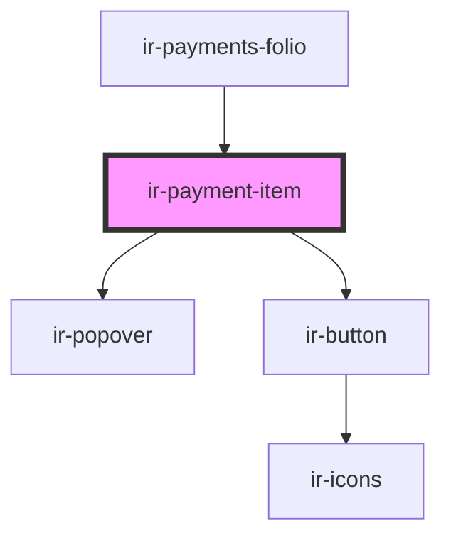

# ir-payment-item

<!-- Auto Generated Below -->

## Properties

| Property  | Attribute | Description | Type       | Default     |
| --------- | --------- | ----------- | ---------- | ----------- |
| `payment` | --        |             | `IPayment` | `undefined` |

## Events

| Event           | Description | Type                    |
| --------------- | ----------- | ----------------------- |
| `deletePayment` |             | `CustomEvent<IPayment>` |
| `editPayment`   |             | `CustomEvent<IPayment>` |

## Shadow Parts

| Part               | Description |
| ------------------ | ----------- |
| `"payment-body"`   |             |
| `"payment-fields"` |             |

## Dependencies

### Used by

 - [ir-payments-folio](../ir-payments-folio)

### Depends on

- [ir-popover](../../../ui/ir-popover)
- [ir-button](../../../ui/ir-button)

### Graph

----------------------------------------------

*Built with [StencilJS](https://stenciljs.com/)*
