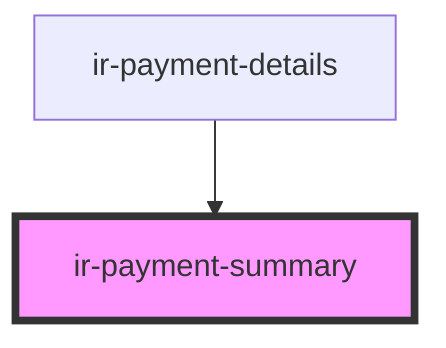

# ir-payment-summary

<!-- Auto Generated Below -->

## Properties

| Property             | Attribute              | Description | Type       | Default     |
| -------------------- | ---------------------- | ----------- | ---------- | ----------- |
| `balance`            | `balance`              |             | `number`   | `undefined` |
| `collected`          | `collected`            |             | `number`   | `undefined` |
| `currency`           | --                     |             | `Currency` | `undefined` |
| `isBookingCancelled` | `is-booking-cancelled` |             | `boolean`  | `undefined` |
| `totalCost`          | `total-cost`           |             | `number`   | `undefined` |

## Dependencies

### Used by

 - [ir-payment-details](..)

### Graph

----------------------------------------------

*Built with [StencilJS](https://stenciljs.com/)*
