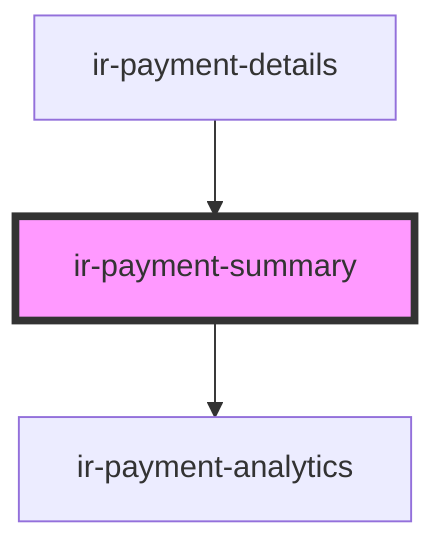

# ir-payment-summary

<!-- Auto Generated Below -->

## Properties

| Property                  | Attribute                     | Description | Type                                                                                                                                                                                                                                                                                                                                                                                                                                                                                                                                                                                                                                                                                                                                                                                                                                                                                                                                                                                                                                                                                                                                                                                                                                                                                                                                                                                                                                                                                                                                                                                                                                                                                                                                                                                      | Default     |
| ------------------------- | ----------------------------- | ----------- | ----------------------------------------------------------------------------------------------------------------------------------------------------------------------------------------------------------------------------------------------------------------------------------------------------------------------------------------------------------------------------------------------------------------------------------------------------------------------------------------------------------------------------------------------------------------------------------------------------------------------------------------------------------------------------------------------------------------------------------------------------------------------------------------------------------------------------------------------------------------------------------------------------------------------------------------------------------------------------------------------------------------------------------------------------------------------------------------------------------------------------------------------------------------------------------------------------------------------------------------------------------------------------------------------------------------------------------------------------------------------------------------------------------------------------------------------------------------------------------------------------------------------------------------------------------------------------------------------------------------------------------------------------------------------------------------------------------------------------------------------------------------------------------------- | ----------- |
| `agent`                   | --                            |             | `{ name?: string; id?: number; email?: string; property_id?: any; code?: string; address?: string; agent_rate_type_code?: { code?: string; description?: string; }; agent_type_code?: { code?: string; description?: string; }; city?: string; contact_name?: string; contract_nbr?: any; country_id?: number; currency_id?: any; due_balance?: any; email_copied_upon_booking?: string; is_active?: boolean; is_send_guest_confirmation_email?: boolean; notes?: string; payment_mode?: { code?: string; description?: string; }; phone?: string; provided_discount?: any; question?: string; sort_order?: any; tax_nbr?: string; reference?: string; verification_mode?: string; has_opening_balance?: boolean; cl_post_timing?: { code?: string; description?: string; }; }`                                                                                                                                                                                                                                                                                                                                                                                                                                                                                                                                                                                                                                                                                                                                                                                                                                                                                                                                                                                                           | `undefined` |
| `balance`                 | `balance`                     |             | `number`                                                                                                                                                                                                                                                                                                                                                                                                                                                                                                                                                                                                                                                                                                                                                                                                                                                                                                                                                                                                                                                                                                                                                                                                                                                                                                                                                                                                                                                                                                                                                                                                                                                                                                                                                                                  | `undefined` |
| `booking`                 | --                            |             | `Booking`                                                                                                                                                                                                                                                                                                                                                                                                                                                                                                                                                                                                                                                                                                                                                                                                                                                                                                                                                                                                                                                                                                                                                                                                                                                                                                                                                                                                                                                                                                                                                                                                                                                                                                                                                                                 | `undefined` |
| `clTransactions`          | --                            |             | `{ PR_ID?: number; ENTRY_DATE?: string; ENTRY_USER_ID?: number; OWNER_ID?: number; DOC_NUMBER?: string; CURRENCY_ID?: number; TOTAL_AMOUNT?: number; CREDIT?: number; DEBIT?: number; NET_AMOUNT?: number; TAX_AMOUNT?: number; FROM_DATE?: string; TO_DATE?: string; BOOK_NBR?: string; EXTERNAL_REF?: string; FD_ID?: number; BH_ID?: number; BSA_REF?: string; CATEGORY?: string; AGENT_BOOKING_NBR?: string; ADULTS_NBR?: number; CHILD_NBR?: number; INFANT_NBR?: number; GUEST_FIRST_NAME?: string; GUEST_LAST_NAME?: string; ROOM_CATEGORY_ID?: number; ROOM_TYPE_ID?: number; RATE_PLAN_ID?: number; SERVICE_DATE?: string; CITY_TAX_AMOUNT?: number; CITY_TAX_PERCENT?: number; CL_TX_ID?: number; CL_TX_TYPE_CODE?: string; DESCRIPTION?: string; IS_HOLD?: boolean; IS_LOCKED?: boolean; My_Bh?: any; My_Currency?: any; My_Fd?: { DOC_NUMBER?: string; FD_TYPE_CODE?: string; CURRENCY_ID?: number; TOTAL_AMOUNT?: number; CREDIT?: number; DEBIT?: number; NET_AMOUNT?: number; TAX_AMOUNT?: number; FROM_DATE?: string; TO_DATE?: string; BOOK_NBR?: string; AGENCY_ID?: number; AGENCY_NAME?: string; CREDIT_DISPLAY?: string; CURRENCY_CODE?: string; DEBIT_DISPLAY?: string; EXTERNAL_REF?: string; FD_ID?: number; FD_STATUS_CODE?: string; FD_STATUS_NAME?: string; FD_TYPE_NAME?: string; ISSUE_DATE?: string; ISSUE_DATE_DISPLAY?: string; IS_PRINTED?: boolean; NET_AMOUNT_DISPLAY?: string; TAX_AMOUNT_DISPLAY?: string; BALANCE_BEFORE_TX?: number; BALANCE_AFTER_TX?: number; }; My_Pr?: any; My_Room_category?: any; RUNNING_BALANCE?: number; My_Room_type?: any; My_Travel_agency?: null; PAY_METHOD_CODE?: string; REL_ENTITY?: "TBL_BSAD" \| "TBL_BSP"; REL_ENTITY_KEY?: number; TRAVEL_AGENCY_ID?: number; VAT_AMOUNT?: number; VAT_PERCENT?: number; }[]` | `[]`        |
| `collected`               | `collected`                   |             | `number`                                                                                                                                                                                                                                                                                                                                                                                                                                                                                                                                                                                                                                                                                                                                                                                                                                                                                                                                                                                                                                                                                                                                                                                                                                                                                                                                                                                                                                                                                                                                                                                                                                                                                                                                                                                  | `undefined` |
| `currency`                | --                            |             | `Currency`                                                                                                                                                                                                                                                                                                                                                                                                                                                                                                                                                                                                                                                                                                                                                                                                                                                                                                                                                                                                                                                                                                                                                                                                                                                                                                                                                                                                                                                                                                                                                                                                                                                                                                                                                                                | `undefined` |
| `isAllServicesAgentOwned` | `is-all-services-agent-owned` |             | `boolean`                                                                                                                                                                                                                                                                                                                                                                                                                                                                                                                                                                                                                                                                                                                                                                                                                                                                                                                                                                                                                                                                                                                                                                                                                                                                                                                                                                                                                                                                                                                                                                                                                                                                                                                                                                                 | `undefined` |
| `isBookingCancelled`      | `is-booking-cancelled`        |             | `boolean`                                                                                                                                                                                                                                                                                                                                                                                                                                                                                                                                                                                                                                                                                                                                                                                                                                                                                                                                                                                                                                                                                                                                                                                                                                                                                                                                                                                                                                                                                                                                                                                                                                                                                                                                                                                 | `undefined` |
| `totalCost`               | `total-cost`                  |             | `number`                                                                                                                                                                                                                                                                                                                                                                                                                                                                                                                                                                                                                                                                                                                                                                                                                                                                                                                                                                                                                                                                                                                                                                                                                                                                                                                                                                                                                                                                                                                                                                                                                                                                                                                                                                                  | `undefined` |

## Dependencies

### Used by

 - [ir-payment-details](..)

### Depends on

- [ir-payment-analytics](../ir-payment-analytics)

### Graph

```mermaid
graph TD;
  ir-payment-summary --> ir-payment-analytics
  ir-payment-details --> ir-payment-summary
  style ir-payment-summary fill:#f9f,stroke:#333,stroke-width:4px
```

----------------------------------------------

*Built with [StencilJS](https://stenciljs.com/)*
