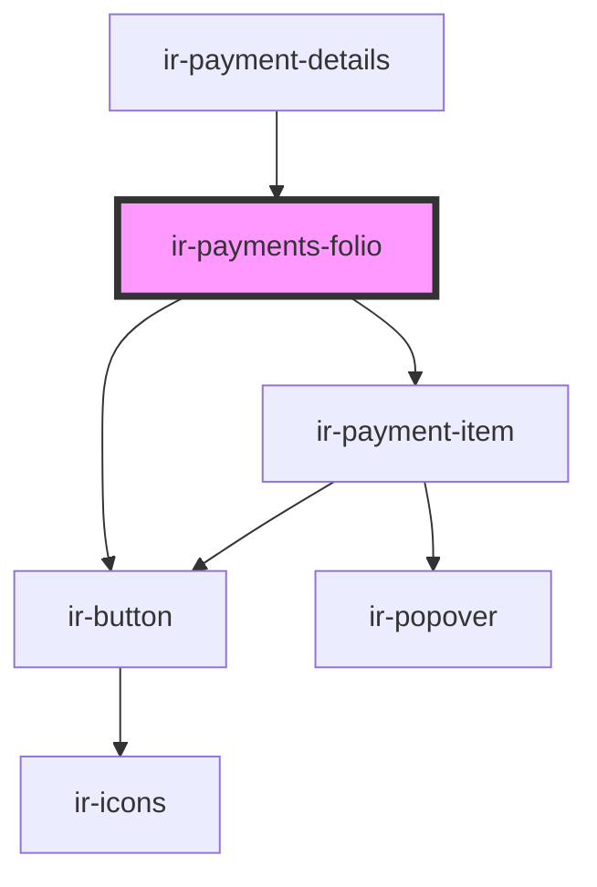

# ir-payments-folio

<!-- Auto Generated Below -->

## Properties

| Property   | Attribute | Description | Type         | Default |
| ---------- | --------- | ----------- | ------------ | ------- |
| `payments` | --        |             | `IPayment[]` | `[]`    |

## Events

| Event           | Description | Type                    |
| --------------- | ----------- | ----------------------- |
| `addPayment`    |             | `CustomEvent<void>`     |
| `deletePayment` |             | `CustomEvent<IPayment>` |
| `editPayment`   |             | `CustomEvent<IPayment>` |

## Dependencies

### Used by

 - [ir-payment-details](..)

### Depends on

- [ir-payment-item](../ir-payment-item)
- [ir-button](../../../ui/ir-button)

### Graph

----------------------------------------------

*Built with [StencilJS](https://stenciljs.com/)*
