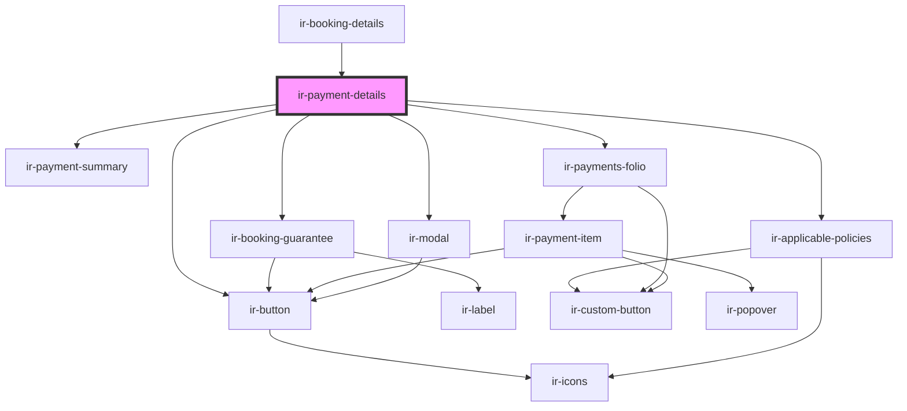

# ir-payment-details

<!-- Auto Generated Below -->

## Properties

| Property         | Attribute     | Description | Type                                                              | Default     |
| ---------------- | ------------- | ----------- | ----------------------------------------------------------------- | ----------- |
| `booking`        | --            |             | `Booking`                                                         | `undefined` |
| `paymentActions` | --            |             | `IPaymentAction[]`                                                | `undefined` |
| `paymentEntries` | --            |             | `{ types: IEntries[]; groups: IEntries[]; methods: IEntries[]; }` | `undefined` |
| `propertyId`     | `property-id` |             | `number`                                                          | `undefined` |

## Events

| Event                               | Description | Type                                                                                                                                            |
| ----------------------------------- | ----------- | ----------------------------------------------------------------------------------------------------------------------------------------------- |
| `openPrintScreen`                   |             | `CustomEvent<{ mode: "printing" \| "invoice" \| "proforma" \| "creditnote"; } \| { mode: "receipt"; payload: { pid: string; rnb: string; }; }>` |
| `openSidebar`                       |             | `CustomEvent<{ type: "payment-folio"; payload: { payment: Payment; mode: FolioEntryMode; }; }>`                                                 |
| `resetBookingEvt`                   |             | `CustomEvent<null>`                                                                                                                             |
| `resetExposedCancellationDueAmount` |             | `CustomEvent<null>`                                                                                                                             |
| `toast`                             |             | `CustomEvent<ICustomToast & Partial<IToastWithButton> \| IDefaultToast & Partial<IToastWithButton>>`                                            |

## Dependencies

### Used by

 - [ir-booking-details](..)

### Depends on

- [ir-payment-summary](ir-payment-summary)
- [ir-booking-guarantee](ir-booking-guarantee)
- [ir-applicable-policies](ir-applicable-policies)
- [ir-button](../../ui/ir-button)
- [ir-payments-folio](ir-payments-folio)
- [ir-modal](../../ui/ir-modal)

### Graph

----------------------------------------------

*Built with [StencilJS](https://stenciljs.com/)*
