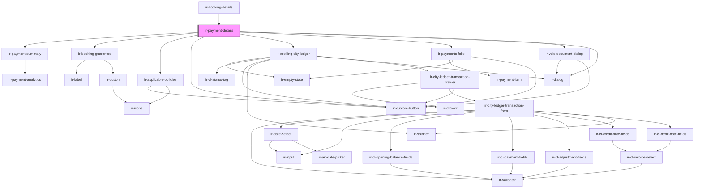

# ir-payment-details

<!-- Auto Generated Below -->

## Properties

| Property                  | Attribute                     | Description | Type                                                                                                                                                                                                                                                                                                                                                                                                                                                                                                                                                                                                                                                                                                                                                                                                                                                                                                                                                                                                                                                                                                                                                                                                                                                                                                                                                                                                                                                                                                                                                                                                                                                                                                                                                                                      | Default     |
| ------------------------- | ----------------------------- | ----------- | ----------------------------------------------------------------------------------------------------------------------------------------------------------------------------------------------------------------------------------------------------------------------------------------------------------------------------------------------------------------------------------------------------------------------------------------------------------------------------------------------------------------------------------------------------------------------------------------------------------------------------------------------------------------------------------------------------------------------------------------------------------------------------------------------------------------------------------------------------------------------------------------------------------------------------------------------------------------------------------------------------------------------------------------------------------------------------------------------------------------------------------------------------------------------------------------------------------------------------------------------------------------------------------------------------------------------------------------------------------------------------------------------------------------------------------------------------------------------------------------------------------------------------------------------------------------------------------------------------------------------------------------------------------------------------------------------------------------------------------------------------------------------------------------- | ----------- |
| `agent`                   | --                            |             | `{ name?: string; id?: number; email?: string; property_id?: any; code?: string; address?: string; agent_rate_type_code?: { code?: string; description?: string; }; agent_type_code?: { code?: string; description?: string; }; city?: string; contact_name?: string; contract_nbr?: any; country_id?: number; currency_id?: any; due_balance?: any; email_copied_upon_booking?: string; is_active?: boolean; is_send_guest_confirmation_email?: boolean; notes?: string; payment_mode?: { code?: string; description?: string; }; phone?: string; provided_discount?: any; question?: string; sort_order?: any; tax_nbr?: string; reference?: string; verification_mode?: string; has_opening_balance?: boolean; cl_post_timing?: { code?: string; description?: string; }; }`                                                                                                                                                                                                                                                                                                                                                                                                                                                                                                                                                                                                                                                                                                                                                                                                                                                                                                                                                                                                           | `undefined` |
| `booking`                 | --                            |             | `Booking`                                                                                                                                                                                                                                                                                                                                                                                                                                                                                                                                                                                                                                                                                                                                                                                                                                                                                                                                                                                                                                                                                                                                                                                                                                                                                                                                                                                                                                                                                                                                                                                                                                                                                                                                                                                 | `undefined` |
| `clError`                 | `cl-error`                    |             | `string`                                                                                                                                                                                                                                                                                                                                                                                                                                                                                                                                                                                                                                                                                                                                                                                                                                                                                                                                                                                                                                                                                                                                                                                                                                                                                                                                                                                                                                                                                                                                                                                                                                                                                                                                                                                  | `null`      |
| `clLoading`               | `cl-loading`                  |             | `boolean`                                                                                                                                                                                                                                                                                                                                                                                                                                                                                                                                                                                                                                                                                                                                                                                                                                                                                                                                                                                                                                                                                                                                                                                                                                                                                                                                                                                                                                                                                                                                                                                                                                                                                                                                                                                 | `false`     |
| `clTransactions`          | --                            |             | `{ PR_ID?: number; ENTRY_DATE?: string; ENTRY_USER_ID?: number; OWNER_ID?: number; DOC_NUMBER?: string; CURRENCY_ID?: number; TOTAL_AMOUNT?: number; CREDIT?: number; DEBIT?: number; NET_AMOUNT?: number; TAX_AMOUNT?: number; FROM_DATE?: string; TO_DATE?: string; BOOK_NBR?: string; EXTERNAL_REF?: string; FD_ID?: number; BH_ID?: number; BSA_REF?: string; CATEGORY?: string; AGENT_BOOKING_NBR?: string; ADULTS_NBR?: number; CHILD_NBR?: number; INFANT_NBR?: number; GUEST_FIRST_NAME?: string; GUEST_LAST_NAME?: string; ROOM_CATEGORY_ID?: number; ROOM_TYPE_ID?: number; RATE_PLAN_ID?: number; SERVICE_DATE?: string; CITY_TAX_AMOUNT?: number; CITY_TAX_PERCENT?: number; CL_TX_ID?: number; CL_TX_TYPE_CODE?: string; DESCRIPTION?: string; IS_HOLD?: boolean; IS_LOCKED?: boolean; My_Bh?: any; My_Currency?: any; My_Fd?: { DOC_NUMBER?: string; FD_TYPE_CODE?: string; CURRENCY_ID?: number; TOTAL_AMOUNT?: number; CREDIT?: number; DEBIT?: number; NET_AMOUNT?: number; TAX_AMOUNT?: number; FROM_DATE?: string; TO_DATE?: string; BOOK_NBR?: string; AGENCY_ID?: number; AGENCY_NAME?: string; CREDIT_DISPLAY?: string; CURRENCY_CODE?: string; DEBIT_DISPLAY?: string; EXTERNAL_REF?: string; FD_ID?: number; FD_STATUS_CODE?: string; FD_STATUS_NAME?: string; FD_TYPE_NAME?: string; ISSUE_DATE?: string; ISSUE_DATE_DISPLAY?: string; IS_PRINTED?: boolean; NET_AMOUNT_DISPLAY?: string; TAX_AMOUNT_DISPLAY?: string; BALANCE_BEFORE_TX?: number; BALANCE_AFTER_TX?: number; }; My_Pr?: any; My_Room_category?: any; RUNNING_BALANCE?: number; My_Room_type?: any; My_Travel_agency?: null; PAY_METHOD_CODE?: string; REL_ENTITY?: "TBL_BSAD" \| "TBL_BSP"; REL_ENTITY_KEY?: number; TRAVEL_AGENCY_ID?: number; VAT_AMOUNT?: number; VAT_PERCENT?: number; }[]` | `[]`        |
| `folioRows`               | --                            |             | `FolioRow[]`                                                                                                                                                                                                                                                                                                                                                                                                                                                                                                                                                                                                                                                                                                                                                                                                                                                                                                                                                                                                                                                                                                                                                                                                                                                                                                                                                                                                                                                                                                                                                                                                                                                                                                                                                                              | `[]`        |
| `isAllServicesAgentOwned` | `is-all-services-agent-owned` |             | `boolean`                                                                                                                                                                                                                                                                                                                                                                                                                                                                                                                                                                                                                                                                                                                                                                                                                                                                                                                                                                                                                                                                                                                                                                                                                                                                                                                                                                                                                                                                                                                                                                                                                                                                                                                                                                                 | `false`     |
| `language`                | `language`                    |             | `string`                                                                                                                                                                                                                                                                                                                                                                                                                                                                                                                                                                                                                                                                                                                                                                                                                                                                                                                                                                                                                                                                                                                                                                                                                                                                                                                                                                                                                                                                                                                                                                                                                                                                                                                                                                                  | `'en'`      |
| `paymentActions`          | --                            |             | `IPaymentAction[]`                                                                                                                                                                                                                                                                                                                                                                                                                                                                                                                                                                                                                                                                                                                                                                                                                                                                                                                                                                                                                                                                                                                                                                                                                                                                                                                                                                                                                                                                                                                                                                                                                                                                                                                                                                        | `undefined` |
| `paymentEntries`          | --                            |             | `{ types: IEntries[]; groups: IEntries[]; methods: IEntries[]; }`                                                                                                                                                                                                                                                                                                                                                                                                                                                                                                                                                                                                                                                                                                                                                                                                                                                                                                                                                                                                                                                                                                                                                                                                                                                                                                                                                                                                                                                                                                                                                                                                                                                                                                                         | `undefined` |
| `propertyId`              | `property-id`                 |             | `number`                                                                                                                                                                                                                                                                                                                                                                                                                                                                                                                                                                                                                                                                                                                                                                                                                                                                                                                                                                                                                                                                                                                                                                                                                                                                                                                                                                                                                                                                                                                                                                                                                                                                                                                                                                                  | `undefined` |
| `svcCategories`           | --                            |             | `IEntries[]`                                                                                                                                                                                                                                                                                                                                                                                                                                                                                                                                                                                                                                                                                                                                                                                                                                                                                                                                                                                                                                                                                                                                                                                                                                                                                                                                                                                                                                                                                                                                                                                                                                                                                                                                                                              | `undefined` |

## Events

| Event                               | Description                                                                   | Type                                                                                                                                            |
| ----------------------------------- | ----------------------------------------------------------------------------- | ----------------------------------------------------------------------------------------------------------------------------------------------- |
| `guestDocumentPreview`              | Opens an existing guest document (e.g. receipt) in the shared in-app preview. | `CustomEvent<GuestDocumentPreviewRequest>`                                                                                                      |
| `openPrintScreen`                   |                                                                               | `CustomEvent<{ mode: "invoice" \| "printing" \| "proforma" \| "creditnote"; } \| { mode: "receipt"; payload: { pid: string; rnb: string; }; }>` |
| `openSidebar`                       |                                                                               | `CustomEvent<{ type: "payment-folio"; payload: { payment: Payment; mode: FolioEntryMode; }; }>`                                                 |
| `resetBookingEvt`                   |                                                                               | `CustomEvent<null>`                                                                                                                             |
| `resetExposedCancellationDueAmount` |                                                                               | `CustomEvent<null>`                                                                                                                             |
| `toast`                             |                                                                               | `CustomEvent<ICustomToast & Partial<IToastWithButton> \| IDefaultToast & Partial<IToastWithButton>>`                                            |

## Dependencies

### Used by

 - [ir-booking-details](..)

### Depends on

- [ir-payment-summary](ir-payment-summary)
- [ir-booking-guarantee](ir-booking-guarantee)
- [ir-applicable-policies](ir-applicable-policies)
- [ir-custom-button](../../ui/ir-custom-button)
- [ir-booking-city-ledger](../ir-booking-city-ledger)
- [ir-payments-folio](ir-payments-folio)
- [ir-void-document-dialog](../ir-void-document-dialog)
- [ir-dialog](../../ui/ir-dialog)

### Graph

```mermaid
graph TD;
  ir-payment-details --> ir-payment-summary
  ir-payment-details --> ir-booking-guarantee
  ir-payment-details --> ir-applicable-policies
  ir-payment-details --> ir-custom-button
  ir-payment-details --> ir-booking-city-ledger
  ir-payment-details --> ir-payments-folio
  ir-payment-details --> ir-void-document-dialog
  ir-payment-details --> ir-dialog
  ir-payment-summary --> ir-payment-analytics
  ir-booking-guarantee --> ir-label
  ir-booking-guarantee --> ir-button
  ir-button --> ir-icons
  ir-applicable-policies --> ir-custom-button
  ir-applicable-policies --> ir-icons
  ir-booking-city-ledger --> ir-empty-state
  ir-booking-city-ledger --> ir-cl-status-tag
  ir-booking-city-ledger --> ir-custom-button
  ir-booking-city-ledger --> ir-spinner
  ir-booking-city-ledger --> ir-city-ledger-transaction-drawer
  ir-booking-city-ledger --> ir-dialog
  ir-city-ledger-transaction-drawer --> ir-drawer
  ir-city-ledger-transaction-drawer --> ir-city-ledger-transaction-form
  ir-city-ledger-transaction-drawer --> ir-custom-button
  ir-city-ledger-transaction-form --> ir-validator
  ir-city-ledger-transaction-form --> ir-date-select
  ir-city-ledger-transaction-form --> ir-input
  ir-city-ledger-transaction-form --> ir-cl-opening-balance-fields
  ir-city-ledger-transaction-form --> ir-cl-payment-fields
  ir-city-ledger-transaction-form --> ir-cl-adjustment-fields
  ir-city-ledger-transaction-form --> ir-cl-credit-note-fields
  ir-city-ledger-transaction-form --> ir-cl-debit-note-fields
  ir-city-ledger-transaction-form --> ir-spinner
  ir-date-select --> ir-input
  ir-date-select --> ir-air-date-picker
  ir-cl-opening-balance-fields --> ir-validator
  ir-cl-payment-fields --> ir-validator
  ir-cl-adjustment-fields --> ir-validator
  ir-cl-credit-note-fields --> ir-cl-invoice-select
  ir-cl-invoice-select --> ir-validator
  ir-cl-debit-note-fields --> ir-cl-invoice-select
  ir-payments-folio --> ir-payment-item
  ir-payments-folio --> ir-empty-state
  ir-payments-folio --> ir-custom-button
  ir-void-document-dialog --> ir-dialog
  ir-void-document-dialog --> ir-custom-button
  ir-booking-details --> ir-payment-details
  style ir-payment-details fill:#f9f,stroke:#333,stroke-width:4px
```

----------------------------------------------

*Built with [StencilJS](https://stenciljs.com/)*
