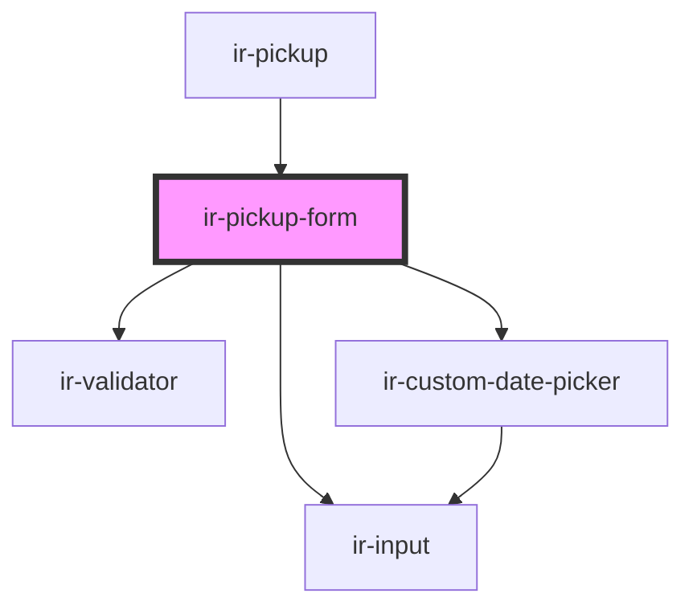

# ir-pickup-form

<!-- Auto Generated Below -->

## Properties

| Property            | Attribute           | Description | Type                            | Default     |
| ------------------- | ------------------- | ----------- | ------------------------------- | ----------- |
| `bookingDates`      | --                  |             | `{ from: string; to: string; }` | `undefined` |
| `bookingNumber`     | `booking-number`    |             | `string`                        | `undefined` |
| `defaultPickupData` | --                  |             | `IBookingPickupInfo`            | `undefined` |
| `formId`            | `form-id`           |             | `string`                        | `undefined` |
| `numberOfPersons`   | `number-of-persons` |             | `number`                        | `0`         |

## Events

| Event                   | Description | Type                   |
| ----------------------- | ----------- | ---------------------- |
| `canSubmitPickupChange` |             | `CustomEvent<boolean>` |
| `closeModal`            |             | `CustomEvent<null>`    |
| `loadingChange`         |             | `CustomEvent<boolean>` |
| `resetBookingEvt`       |             | `CustomEvent<null>`    |

## Dependencies

### Used by

 - [ir-pickup](..)

### Depends on

- [ir-validator](../../../ui/ir-validator)
- [ir-custom-date-picker](../../../ir-custom-date-picker)
- [ir-input](../../../ui/ir-input)

### Graph

----------------------------------------------

*Built with [StencilJS](https://stenciljs.com/)*
