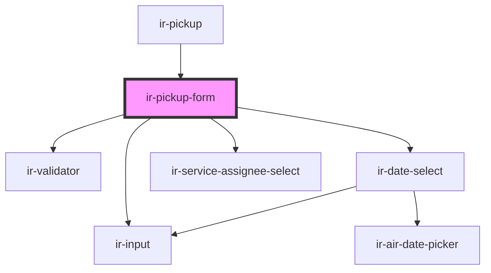

# ir-pickup-form

<!-- Auto Generated Below -->

## Properties

| Property               | Attribute           | Description | Type                                                                                                                                                                                                                                                                                                                                                                                                                                                                                                                                                                                                                                                                                                                                                                            | Default     |
| ---------------------- | ------------------- | ----------- | ------------------------------------------------------------------------------------------------------------------------------------------------------------------------------------------------------------------------------------------------------------------------------------------------------------------------------------------------------------------------------------------------------------------------------------------------------------------------------------------------------------------------------------------------------------------------------------------------------------------------------------------------------------------------------------------------------------------------------------------------------------------------------- | ----------- |
| `agent`                | --                  |             | `{ name?: string; id?: number; email?: string; property_id?: any; code?: string; address?: string; agent_rate_type_code?: { code?: string; description?: string; }; agent_type_code?: { code?: string; description?: string; }; city?: string; contact_name?: string; contract_nbr?: any; country_id?: number; currency_id?: any; due_balance?: any; email_copied_upon_booking?: string; is_active?: boolean; is_send_guest_confirmation_email?: boolean; notes?: string; payment_mode?: { code?: string; description?: string; }; phone?: string; provided_discount?: any; question?: string; sort_order?: any; tax_nbr?: string; reference?: string; verification_mode?: string; has_opening_balance?: boolean; cl_post_timing?: { code?: string; description?: string; }; }` | `undefined` |
| `booking` _(required)_ | --                  |             | `Booking`                                                                                                                                                                                                                                                                                                                                                                                                                                                                                                                                                                                                                                                                                                                                                                       | `undefined` |
| `bookingDates`         | --                  |             | `{ from: string; to: string; }`                                                                                                                                                                                                                                                                                                                                                                                                                                                                                                                                                                                                                                                                                                                                                 | `undefined` |
| `bookingNumber`        | `booking-number`    |             | `string`                                                                                                                                                                                                                                                                                                                                                                                                                                                                                                                                                                                                                                                                                                                                                                        | `undefined` |
| `defaultPickupData`    | --                  |             | `IBookingPickupInfo`                                                                                                                                                                                                                                                                                                                                                                                                                                                                                                                                                                                                                                                                                                                                                            | `undefined` |
| `formId`               | `form-id`           |             | `string`                                                                                                                                                                                                                                                                                                                                                                                                                                                                                                                                                                                                                                                                                                                                                                        | `undefined` |
| `numberOfPersons`      | `number-of-persons` |             | `number`                                                                                                                                                                                                                                                                                                                                                                                                                                                                                                                                                                                                                                                                                                                                                                        | `0`         |

## Events

| Event                   | Description | Type                   |
| ----------------------- | ----------- | ---------------------- |
| `canSubmitPickupChange` |             | `CustomEvent<boolean>` |
| `closeModal`            |             | `CustomEvent<null>`    |
| `loadingChange`         |             | `CustomEvent<boolean>` |
| `resetBookingEvt`       |             | `CustomEvent<null>`    |

## Dependencies

### Used by

 - [ir-pickup](..)

### Depends on

- [ir-validator](../../../ui/ir-validator)
- [ir-date-select](../../../ui/date-picker/ir-date-select)
- [ir-input](../../../ui/ir-input)
- [ir-service-assignee-select](../../ir-service-assignee-select)

### Graph

```mermaid
graph TD;
  ir-pickup-form --> ir-validator
  ir-pickup-form --> ir-date-select
  ir-pickup-form --> ir-input
  ir-pickup-form --> ir-service-assignee-select
  ir-date-select --> ir-input
  ir-date-select --> ir-air-date-picker
  ir-pickup --> ir-pickup-form
  style ir-pickup-form fill:#f9f,stroke:#333,stroke-width:4px
```

----------------------------------------------

*Built with [StencilJS](https://stenciljs.com/)*
