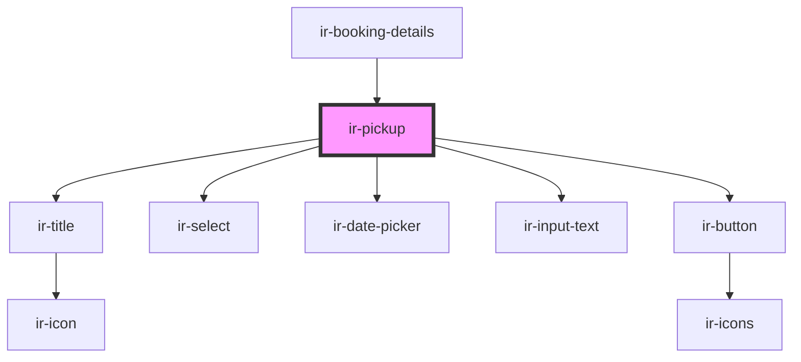

# ir-pickup

<!-- Auto Generated Below -->

## Properties

| Property            | Attribute           | Description | Type                 | Default     |
| ------------------- | ------------------- | ----------- | -------------------- | ----------- |
| `bookingNumber`     | `booking-number`    |             | `string`             | `undefined` |
| `defaultPickupData` | --                  |             | `IBookingPickupInfo` | `undefined` |
| `numberOfPersons`   | `number-of-persons` |             | `number`             | `0`         |

## Events

| Event              | Description | Type                |
| ------------------ | ----------- | ------------------- |
| `closeModal`       |             | `CustomEvent<null>` |
| `resetBookingData` |             | `CustomEvent<null>` |

## Dependencies

### Used by

 - [ir-booking-details](..)

### Depends on

- [ir-title](../../ir-title)
- [ir-select](../../ir-select)
- [ir-date-picker](../../ir-date-picker)
- [ir-input-text](../../ir-input-text)
- [ir-button](../../ir-button)

### Graph

----------------------------------------------

*Built with [StencilJS](https://stenciljs.com/)*
