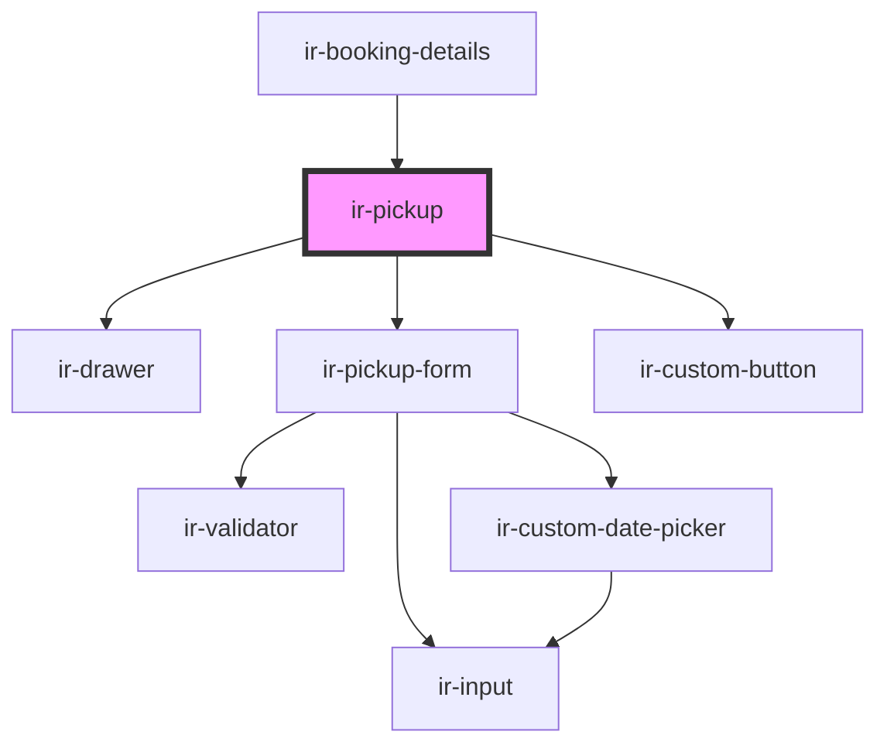

# ir-pickup

<!-- Auto Generated Below -->

## Properties

| Property            | Attribute           | Description                                                                                                                                            | Type                            | Default     |
| ------------------- | ------------------- | ------------------------------------------------------------------------------------------------------------------------------------------------------ | ------------------------------- | ----------- |
| `bookingDates`      | --                  | The date range of the booking (check-in and check-out). Determines allowed pickup dates and validation rules.                                          | `{ from: string; to: string; }` | `undefined` |
| `bookingNumber`     | `booking-number`    | Unique booking reference number used to associate pickup updates with a specific reservation.                                                          | `string`                        | `undefined` |
| `defaultPickupData` | --                  | Pre-filled pickup information coming from the booking. When provided, the pickup form initializes with this data and the user may update or remove it. | `IBookingPickupInfo`            | `undefined` |
| `numberOfPersons`   | `number-of-persons` | Total number of persons included in the booking. Used to compute vehicle capacity and validate pickup options.                                         | `number`                        | `0`         |
| `open`              | `open`              | Controls whether the pickup drawer/modal is open. When true, the drawer becomes visible and initializes the form.                                      | `boolean`                       | `undefined` |

## Events

| Event        | Description                                                                                                                                              | Type                |
| ------------ | -------------------------------------------------------------------------------------------------------------------------------------------------------- | ------------------- |
| `closeModal` | Emitted when the pickup drawer should be closed. Triggered when the user dismisses the drawer or when the inner pickup form requests the modal to close. | `CustomEvent<null>` |

## Dependencies

### Used by

 - [ir-booking-details](..)

### Depends on

- [ir-drawer](../../ir-drawer)
- [ir-pickup-form](ir-pickup-form)
- [ir-custom-button](../../ui/ir-custom-button)

### Graph

----------------------------------------------

*Built with [StencilJS](https://stenciljs.com/)*
