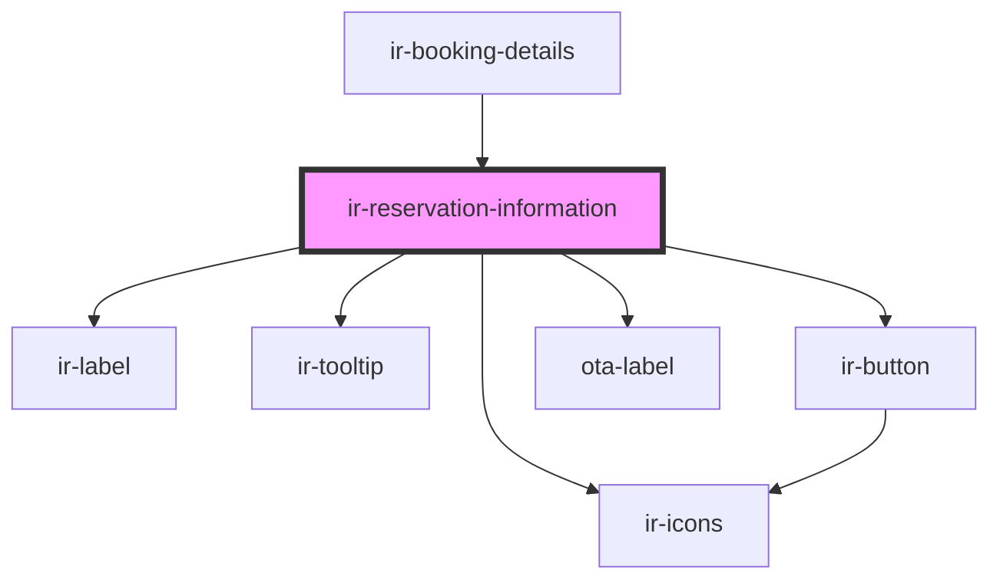

# ir-reservation-information

<!-- Auto Generated Below -->

## Properties

| Property    | Attribute | Description | Type         | Default     |
| ----------- | --------- | ----------- | ------------ | ----------- |
| `booking`   | --        |             | `Booking`    | `undefined` |
| `countries` | --        |             | `ICountry[]` | `undefined` |

## Events

| Event         | Description | Type                                                                 |
| ------------- | ----------- | -------------------------------------------------------------------- |
| `openSidebar` |             | `CustomEvent<{ type: BookingDetailsSidebarEvents; payload?: any; }>` |

## Dependencies

### Used by

 - [ir-booking-details](..)

### Depends on

- [ir-label](../../ui/ir-label)
- [ir-tooltip](../../ui/ir-tooltip)
- [ir-icons](../../ui/ir-icons)
- [ir-button](../../ui/ir-button)
- [ota-label](../../ui/ota-label)

### Graph

----------------------------------------------

*Built with [StencilJS](https://stenciljs.com/)*
