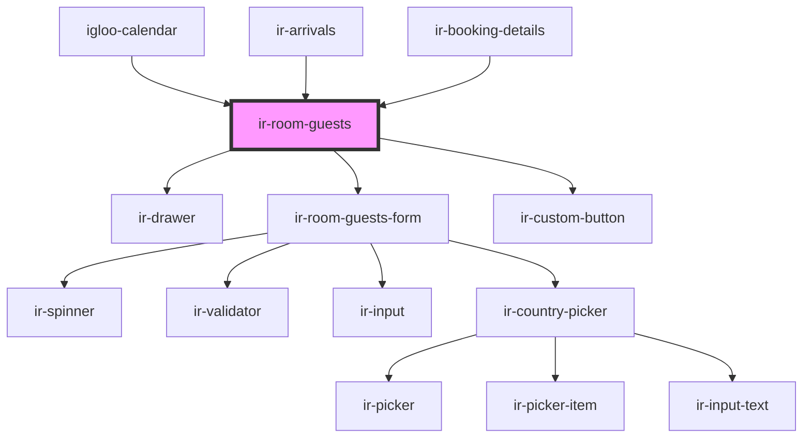

# ir-room-guests

<!-- Auto Generated Below -->

## Properties

| Property        | Attribute        | Description                                                                                                                                                                                                      | Type             | Default     |
| --------------- | ---------------- | ---------------------------------------------------------------------------------------------------------------------------------------------------------------------------------------------------------------- | ---------------- | ----------- |
| `bookingNumber` | `booking-number` | A unique booking number associated with the room. This is used for backend operations like saving guest information or checking in the room.                                                                     | `string`         | `undefined` |
| `checkIn`       | `check-in`       | A boolean indicating whether the room is in the process of being checked in. If true, additional actions like saving the room state as "checked in" are performed.                                               | `boolean`        | `undefined` |
| `countries`     | --               | A list of available countries. Used to populate dropdowns for selecting the {locales.entries.Lcz_Nationality} of guests.                                                                                         | `ICountry[]`     | `undefined` |
| `identifier`    | `identifier`     | A unique identifier for the room. This is used to distinguish between rooms, especially when performing operations like saving or checking in guests.                                                            | `string`         | `undefined` |
| `language`      | `language`       | The language used for displaying text content in the component. Defaults to English ('en'), but can be set to other supported languages.                                                                         | `string`         | `'en'`      |
| `open`          | `open`           |                                                                                                                                                                                                                  | `boolean`        | `undefined` |
| `roomName`      | `room-name`      | The name of the room currently being displayed. Used to label the room in the user interface for clarity.                                                                                                        | `string`         | `undefined` |
| `sharedPersons` | --               | An array of people sharing the room. Contains information about the {locales.entries.Lcz_MainGuest} and additional guests, such as their name, date of birth, {locales.entries.Lcz_Nationality}, and ID details. | `SharedPerson[]` | `[]`        |
| `totalGuests`   | `total-guests`   | The total number of guests for the room. Determines how many guest input forms to display in the UI.                                                                                                             | `number`         | `0`         |

## Events

| Event        | Description | Type                |
| ------------ | ----------- | ------------------- |
| `closeModal` |             | `CustomEvent<null>` |

## Dependencies

### Used by

 - [igloo-calendar](../../igloo-calendar)
 - [ir-arrivals](../../ir-arrivals)
 - [ir-booking-details](..)

### Depends on

- [ir-drawer](../../ir-drawer)
- [ir-room-guests-form](ir-room-guests-form)
- [ir-custom-button](../../ui/ir-custom-button)

### Graph

----------------------------------------------

*Built with [StencilJS](https://stenciljs.com/)*
