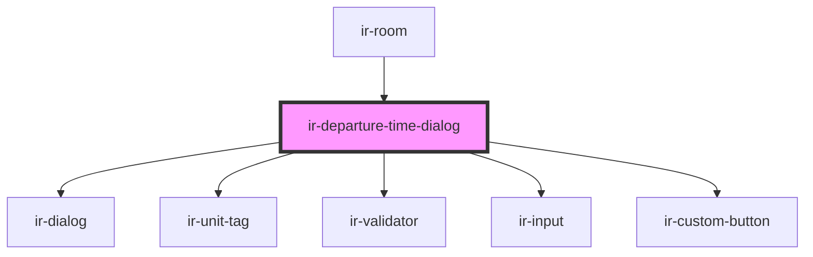

# ir-departure-time-dialog

<!-- Auto Generated Below -->

## Overview

Dialog that lets staff set or change the expected departure time for a single room.
Persists the choice via BookingService.setDepartureTime and emits `departureTimeClose`
when it closes so the parent can refresh the booking.

Usage:
  <ir-departure-time-dialog
    room={room}
    open={isOpen}
    property_id={propertyId}
    departureTime={departureTimeEntries}
    onDepartureTimeClose={e => { isOpen = false; if (e.detail.saved) refresh(); }}
  />

## Properties

| Property         | Attribute         | Description                                                                           | Type         | Default     |
| ---------------- | ----------------- | ------------------------------------------------------------------------------------- | ------------ | ----------- |
| `booking`        | --                | Needed to look up whether this room already has a late-checkout extra service charge. | `Booking`    | `undefined` |
| `booking_nbr`    | `booking_nbr`     | Needed to create a late-checkout extra service charge alongside the departure time.   | `string`     | `undefined` |
| `currencySymbol` | `currency-symbol` |                                                                                       | `string`     | `undefined` |
| `currency_id`    | `currency_id`     |                                                                                       | `number`     | `undefined` |
| `departureTime`  | --                |                                                                                       | `IEntries[]` | `[]`        |
| `language`       | `language`        |                                                                                       | `string`     | `'en'`      |
| `open`           | `open`            | Controls dialog visibility.                                                           | `boolean`    | `undefined` |
| `property_id`    | `property_id`     |                                                                                       | `number`     | `undefined` |
| `room`           | --                | Room whose expected departure time is being changed.                                  | `Room`       | `undefined` |

## Events

| Event                | Description                                                                                                  | Type                               |
| -------------------- | ------------------------------------------------------------------------------------------------------------ | ---------------------------------- |
| `departureTimeClose` | Fired when the dialog closes. `saved: true` → departure time was persisted; `saved: false` → user cancelled. | `CustomEvent<{ saved: boolean; }>` |

## Dependencies

### Used by

 - [ir-room](..)

### Depends on

- [ir-dialog](../../../ui/ir-dialog)
- [ir-unit-tag](../../../ir-unit-tag)
- [ir-validator](../../../ui/ir-validator)
- [ir-input](../../../ui/ir-input)
- [ir-custom-button](../../../ui/ir-custom-button)

### Graph

----------------------------------------------

*Built with [StencilJS](https://stenciljs.com/)*
