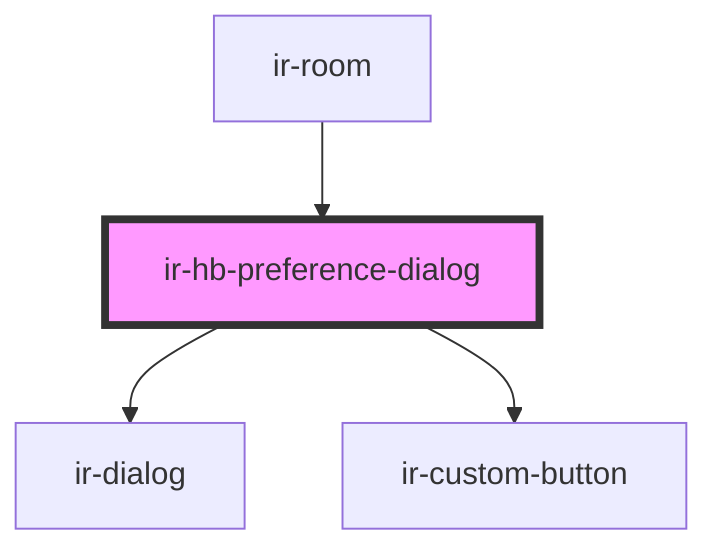

# ir-hb-preference-dialog

<!-- Auto Generated Below -->

## Overview

Dialog that lets staff set or change the half-board meal preference (lunch / dinner)
for a single room. Persists the choice via BookingService.setHbPreference and emits
`hbPreferenceClose` when it closes so the parent can refresh the booking.

Usage:
  <ir-hb-preference-dialog
    room={room}
    open={isOpen}
    onHbPreferenceClose={e => { isOpen = false; if (e.detail.saved) refresh(); }}
  />

## Properties

| Property | Attribute | Description                                        | Type      | Default     |
| -------- | --------- | -------------------------------------------------- | --------- | ----------- |
| `open`   | `open`    | Controls dialog visibility.                        | `boolean` | `undefined` |
| `room`   | --        | Room whose half-board preference is being changed. | `Room`    | `undefined` |

## Events

| Event               | Description                                                                                              | Type                               |
| ------------------- | -------------------------------------------------------------------------------------------------------- | ---------------------------------- |
| `hbPreferenceClose` | Fired when the dialog closes. `saved: true` → preference was persisted; `saved: false` → user cancelled. | `CustomEvent<{ saved: boolean; }>` |

## Dependencies

### Used by

 - [ir-room](..)

### Depends on

- [ir-dialog](../../../ui/ir-dialog)
- [ir-custom-button](../../../ui/ir-custom-button)

### Graph

----------------------------------------------

*Built with [StencilJS](https://stenciljs.com/)*
