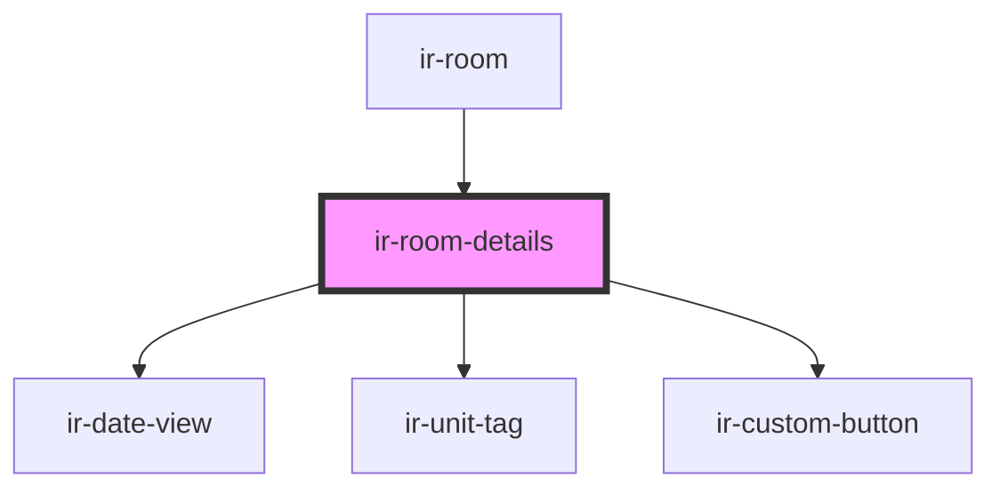

# ir-room-details

<!-- Auto Generated Below -->

## Properties

| Property               | Attribute                | Description | Type           | Default     |
| ---------------------- | ------------------------ | ----------- | -------------- | ----------- |
| `bedPreferences`       | --                       |             | `IEntries[]`   | `undefined` |
| `booking`              | --                       |             | `Booking`      | `undefined` |
| `hasCheckIn`           | `has-check-in`           |             | `boolean`      | `false`     |
| `hasCheckOut`          | `has-check-out`          |             | `boolean`      | `false`     |
| `includeDepartureTime` | `include-departure-time` |             | `boolean`      | `undefined` |
| `language`             | `language`               |             | `string`       | `'en'`      |
| `mainGuest`            | --                       |             | `SharedPerson` | `undefined` |
| `room`                 | --                       |             | `Room`         | `undefined` |

## Events

| Event                 | Description | Type                |
| --------------------- | ----------- | ------------------- |
| `checkIn`             |             | `CustomEvent<void>` |
| `checkOut`            |             | `CustomEvent<void>` |
| `openArrivalDialog`   |             | `CustomEvent<void>` |
| `openDepartureDialog` |             | `CustomEvent<void>` |
| `viewGuests`          |             | `CustomEvent<void>` |

## Dependencies

### Used by

 - [ir-room](..)

### Depends on

- [ir-date-view](../../../ir-date-view)
- [ir-unit-tag](../../../ir-unit-tag)
- [ir-custom-button](../../../ui/ir-custom-button)

### Graph

----------------------------------------------

*Built with [StencilJS](https://stenciljs.com/)*
