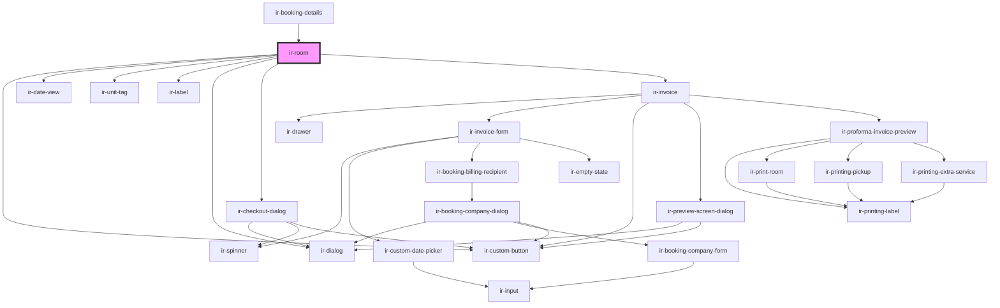

# ir-room

<!-- Auto Generated Below -->

## Properties

| Property               | Attribute                | Description | Type         | Default     |
| ---------------------- | ------------------------ | ----------- | ------------ | ----------- |
| `bedPreferences`       | --                       |             | `IEntries[]` | `undefined` |
| `booking`              | --                       |             | `Booking`    | `undefined` |
| `bookingIndex`         | `booking-index`          |             | `number`     | `undefined` |
| `currency`             | `currency`               |             | `string`     | `'USD'`     |
| `departureTime`        | --                       |             | `IEntries[]` | `undefined` |
| `hasCheckIn`           | `has-check-in`           |             | `boolean`    | `false`     |
| `hasCheckOut`          | `has-check-out`          |             | `boolean`    | `false`     |
| `hasRoomAdd`           | `has-room-add`           |             | `boolean`    | `false`     |
| `hasRoomDelete`        | `has-room-delete`        |             | `boolean`    | `false`     |
| `hasRoomEdit`          | `has-room-edit`          |             | `boolean`    | `false`     |
| `includeDepartureTime` | `include-departure-time` |             | `boolean`    | `undefined` |
| `isEditable`           | `is-editable`            |             | `boolean`    | `undefined` |
| `language`             | `language`               |             | `string`     | `'en'`      |
| `legendData`           | `legend-data`            |             | `any`        | `undefined` |
| `mealCodeName`         | `meal-code-name`         |             | `string`     | `undefined` |
| `myRoomTypeFoodCat`    | `my-room-type-food-cat`  |             | `string`     | `undefined` |
| `property_id`          | `property_id`            |             | `number`     | `undefined` |
| `room`                 | --                       |             | `Room`       | `undefined` |
| `roomsInfo`            | `rooms-info`             |             | `any`        | `undefined` |

## Events

| Event            | Description | Type                                                                                                                                                                                                                                 |
| ---------------- | ----------- | ------------------------------------------------------------------------------------------------------------------------------------------------------------------------------------------------------------------------------------ |
| `deleteFinished` |             | `CustomEvent<string>`                                                                                                                                                                                                                |
| `editInitiated`  |             | `CustomEvent<IglBookPropertyPayloadAddRoom \| IglBookPropertyPayloadBarBooking \| IglBookPropertyPayloadBlockDates \| IglBookPropertyPayloadEditBooking \| IglBookPropertyPayloadPlusBooking \| IglBookPropertyPayloadSplitBooking>` |
| `openSidebar`    |             | `CustomEvent<{ type: BookingDetailsSidebarEvents; payload?: RoomGuestsPayload; }>`                                                                                                                                                   |
| `pressCheckIn`   |             | `CustomEvent<any>`                                                                                                                                                                                                                   |
| `pressCheckOut`  |             | `CustomEvent<any>`                                                                                                                                                                                                                   |
| `resetbooking`   |             | `CustomEvent<null>`                                                                                                                                                                                                                  |
| `toast`          |             | `CustomEvent<ICustomToast & Partial<IToastWithButton> \| IDefaultToast & Partial<IToastWithButton>>`                                                                                                                                 |

## Dependencies

### Used by

 - [ir-booking-details](..)

### Depends on

- [ir-custom-button](../../ui/ir-custom-button)
- [ir-date-view](../../ir-date-view)
- [ir-unit-tag](../../ir-unit-tag)
- [ir-label](../../ui/ir-label)
- [ir-dialog](../../ui/ir-dialog)
- [ir-checkout-dialog](../../ir-checkout-dialog)
- [ir-invoice](../../ir-invoice)

### Graph

----------------------------------------------

*Built with [StencilJS](https://stenciljs.com/)*
