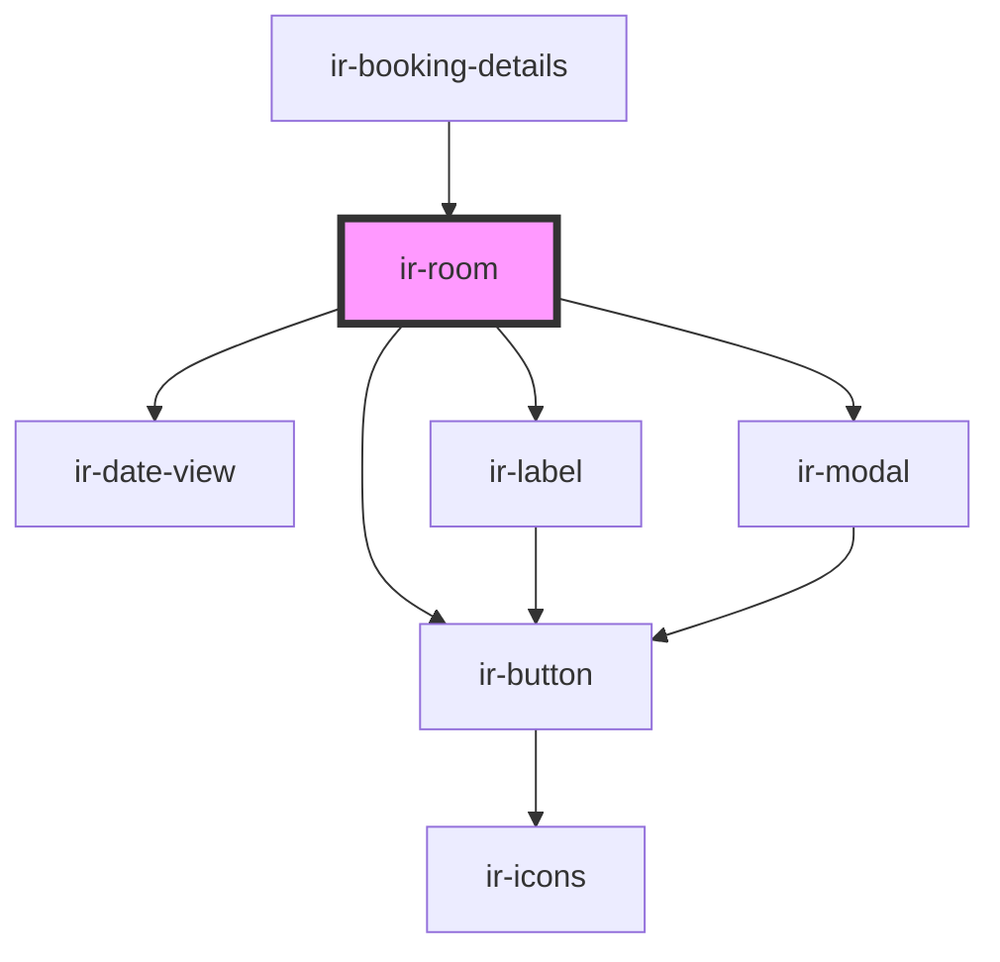

# ir-room

<!-- Auto Generated Below -->

## Properties

| Property            | Attribute               | Description | Type      | Default     |
| ------------------- | ----------------------- | ----------- | --------- | ----------- |
| `bookingEvent`      | --                      |             | `Booking` | `undefined` |
| `bookingIndex`      | `booking-index`         |             | `number`  | `undefined` |
| `currency`          | `currency`              |             | `string`  | `'USD'`     |
| `defaultTexts`      | --                      |             | `ILocale` | `undefined` |
| `hasCheckIn`        | `has-check-in`          |             | `boolean` | `false`     |
| `hasCheckOut`       | `has-check-out`         |             | `boolean` | `false`     |
| `hasRoomAdd`        | `has-room-add`          |             | `boolean` | `false`     |
| `hasRoomDelete`     | `has-room-delete`       |             | `boolean` | `false`     |
| `hasRoomEdit`       | `has-room-edit`         |             | `boolean` | `false`     |
| `isEditable`        | `is-editable`           |             | `boolean` | `undefined` |
| `legendData`        | `legend-data`           |             | `any`     | `undefined` |
| `mealCodeName`      | `meal-code-name`        |             | `string`  | `undefined` |
| `myRoomTypeFoodCat` | `my-room-type-food-cat` |             | `string`  | `undefined` |
| `roomsInfo`         | `rooms-info`            |             | `any`     | `undefined` |
| `ticket`            | `ticket`                |             | `any`     | `undefined` |

## Events

| Event            | Description | Type                                                                                                                                                                                                                                 |
| ---------------- | ----------- | ------------------------------------------------------------------------------------------------------------------------------------------------------------------------------------------------------------------------------------ |
| `deleteFinished` |             | `CustomEvent<string>`                                                                                                                                                                                                                |
| `editInitiated`  |             | `CustomEvent<IglBookPropertyPayloadAddRoom \| IglBookPropertyPayloadBarBooking \| IglBookPropertyPayloadBlockDates \| IglBookPropertyPayloadEditBooking \| IglBookPropertyPayloadPlusBooking \| IglBookPropertyPayloadSplitBooking>` |
| `pressCheckIn`   |             | `CustomEvent<any>`                                                                                                                                                                                                                   |
| `pressCheckOut`  |             | `CustomEvent<any>`                                                                                                                                                                                                                   |

## Dependencies

### Used by

 - [ir-booking-details](..)

### Depends on

- [ir-button](../../ir-button)
- [ir-date-view](../../ir-date-view)
- [ir-label](../../ui/ir-label)
- [ir-modal](../../ir-modal)

### Graph

----------------------------------------------

*Built with [StencilJS](https://stenciljs.com/)*
