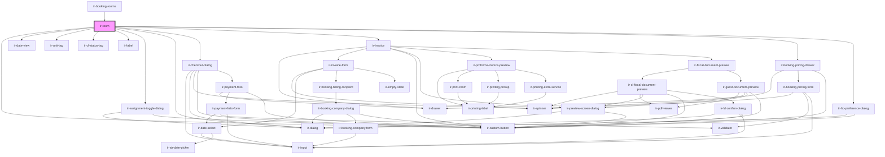

# ir-room

<!-- Auto Generated Below -->

## Properties

| Property               | Attribute                | Description | Type                                                                                                                                                                                                                                                                                                                                                                                                                                                                                                                                                                                                                                                                                                                                                                                                                                                                                                                                                                                                                                                                                                                                                                                                                                                                                                                                                                                                                                                                                                                                                                                                                                                                                                                                                                                      | Default     |
| ---------------------- | ------------------------ | ----------- | ----------------------------------------------------------------------------------------------------------------------------------------------------------------------------------------------------------------------------------------------------------------------------------------------------------------------------------------------------------------------------------------------------------------------------------------------------------------------------------------------------------------------------------------------------------------------------------------------------------------------------------------------------------------------------------------------------------------------------------------------------------------------------------------------------------------------------------------------------------------------------------------------------------------------------------------------------------------------------------------------------------------------------------------------------------------------------------------------------------------------------------------------------------------------------------------------------------------------------------------------------------------------------------------------------------------------------------------------------------------------------------------------------------------------------------------------------------------------------------------------------------------------------------------------------------------------------------------------------------------------------------------------------------------------------------------------------------------------------------------------------------------------------------------- | ----------- |
| `agent`                | --                       |             | `{ name?: string; id?: number; email?: string; property_id?: any; code?: string; address?: string; agent_rate_type_code?: { code?: string; description?: string; }; agent_type_code?: { code?: string; description?: string; }; city?: string; contact_name?: string; contract_nbr?: any; country_id?: number; currency_id?: any; due_balance?: any; email_copied_upon_booking?: string; is_active?: boolean; is_send_guest_confirmation_email?: boolean; notes?: string; payment_mode?: { code?: string; description?: string; }; phone?: string; provided_discount?: any; question?: string; sort_order?: any; tax_nbr?: string; reference?: string; verification_mode?: string; has_opening_balance?: boolean; cl_post_timing?: { code?: string; description?: string; }; }`                                                                                                                                                                                                                                                                                                                                                                                                                                                                                                                                                                                                                                                                                                                                                                                                                                                                                                                                                                                                           | `undefined` |
| `bedPreferences`       | --                       |             | `IEntries[]`                                                                                                                                                                                                                                                                                                                                                                                                                                                                                                                                                                                                                                                                                                                                                                                                                                                                                                                                                                                                                                                                                                                                                                                                                                                                                                                                                                                                                                                                                                                                                                                                                                                                                                                                                                              | `undefined` |
| `booking`              | --                       |             | `Booking`                                                                                                                                                                                                                                                                                                                                                                                                                                                                                                                                                                                                                                                                                                                                                                                                                                                                                                                                                                                                                                                                                                                                                                                                                                                                                                                                                                                                                                                                                                                                                                                                                                                                                                                                                                                 | `undefined` |
| `bookingIndex`         | `booking-index`          |             | `number`                                                                                                                                                                                                                                                                                                                                                                                                                                                                                                                                                                                                                                                                                                                                                                                                                                                                                                                                                                                                                                                                                                                                                                                                                                                                                                                                                                                                                                                                                                                                                                                                                                                                                                                                                                                  | `undefined` |
| `clTransactions`       | --                       |             | `{ PR_ID?: number; ENTRY_DATE?: string; ENTRY_USER_ID?: number; OWNER_ID?: number; DOC_NUMBER?: string; CURRENCY_ID?: number; TOTAL_AMOUNT?: number; CREDIT?: number; DEBIT?: number; NET_AMOUNT?: number; TAX_AMOUNT?: number; FROM_DATE?: string; TO_DATE?: string; BOOK_NBR?: string; EXTERNAL_REF?: string; FD_ID?: number; BH_ID?: number; BSA_REF?: string; CATEGORY?: string; AGENT_BOOKING_NBR?: string; ADULTS_NBR?: number; CHILD_NBR?: number; INFANT_NBR?: number; GUEST_FIRST_NAME?: string; GUEST_LAST_NAME?: string; ROOM_CATEGORY_ID?: number; ROOM_TYPE_ID?: number; RATE_PLAN_ID?: number; SERVICE_DATE?: string; CITY_TAX_AMOUNT?: number; CITY_TAX_PERCENT?: number; CL_TX_ID?: number; CL_TX_TYPE_CODE?: string; DESCRIPTION?: string; IS_HOLD?: boolean; IS_LOCKED?: boolean; My_Bh?: any; My_Currency?: any; My_Fd?: { DOC_NUMBER?: string; FD_TYPE_CODE?: string; CURRENCY_ID?: number; TOTAL_AMOUNT?: number; CREDIT?: number; DEBIT?: number; NET_AMOUNT?: number; TAX_AMOUNT?: number; FROM_DATE?: string; TO_DATE?: string; BOOK_NBR?: string; AGENCY_ID?: number; AGENCY_NAME?: string; CREDIT_DISPLAY?: string; CURRENCY_CODE?: string; DEBIT_DISPLAY?: string; EXTERNAL_REF?: string; FD_ID?: number; FD_STATUS_CODE?: string; FD_STATUS_NAME?: string; FD_TYPE_NAME?: string; ISSUE_DATE?: string; ISSUE_DATE_DISPLAY?: string; IS_PRINTED?: boolean; NET_AMOUNT_DISPLAY?: string; TAX_AMOUNT_DISPLAY?: string; BALANCE_BEFORE_TX?: number; BALANCE_AFTER_TX?: number; }; My_Pr?: any; My_Room_category?: any; RUNNING_BALANCE?: number; My_Room_type?: any; My_Travel_agency?: null; PAY_METHOD_CODE?: string; REL_ENTITY?: "TBL_BSAD" \| "TBL_BSP"; REL_ENTITY_KEY?: number; TRAVEL_AGENCY_ID?: number; VAT_AMOUNT?: number; VAT_PERCENT?: number; }[]` | `[]`        |
| `currency`             | `currency`               |             | `string`                                                                                                                                                                                                                                                                                                                                                                                                                                                                                                                                                                                                                                                                                                                                                                                                                                                                                                                                                                                                                                                                                                                                                                                                                                                                                                                                                                                                                                                                                                                                                                                                                                                                                                                                                                                  | `'USD'`     |
| `departureTime`        | --                       |             | `IEntries[]`                                                                                                                                                                                                                                                                                                                                                                                                                                                                                                                                                                                                                                                                                                                                                                                                                                                                                                                                                                                                                                                                                                                                                                                                                                                                                                                                                                                                                                                                                                                                                                                                                                                                                                                                                                              | `undefined` |
| `hasCheckIn`           | `has-check-in`           |             | `boolean`                                                                                                                                                                                                                                                                                                                                                                                                                                                                                                                                                                                                                                                                                                                                                                                                                                                                                                                                                                                                                                                                                                                                                                                                                                                                                                                                                                                                                                                                                                                                                                                                                                                                                                                                                                                 | `false`     |
| `hasCheckOut`          | `has-check-out`          |             | `boolean`                                                                                                                                                                                                                                                                                                                                                                                                                                                                                                                                                                                                                                                                                                                                                                                                                                                                                                                                                                                                                                                                                                                                                                                                                                                                                                                                                                                                                                                                                                                                                                                                                                                                                                                                                                                 | `false`     |
| `hasRoomAdd`           | `has-room-add`           |             | `boolean`                                                                                                                                                                                                                                                                                                                                                                                                                                                                                                                                                                                                                                                                                                                                                                                                                                                                                                                                                                                                                                                                                                                                                                                                                                                                                                                                                                                                                                                                                                                                                                                                                                                                                                                                                                                 | `false`     |
| `hasRoomDelete`        | `has-room-delete`        |             | `boolean`                                                                                                                                                                                                                                                                                                                                                                                                                                                                                                                                                                                                                                                                                                                                                                                                                                                                                                                                                                                                                                                                                                                                                                                                                                                                                                                                                                                                                                                                                                                                                                                                                                                                                                                                                                                 | `false`     |
| `hasRoomEdit`          | `has-room-edit`          |             | `boolean`                                                                                                                                                                                                                                                                                                                                                                                                                                                                                                                                                                                                                                                                                                                                                                                                                                                                                                                                                                                                                                                                                                                                                                                                                                                                                                                                                                                                                                                                                                                                                                                                                                                                                                                                                                                 | `false`     |
| `includeDepartureTime` | `include-departure-time` |             | `boolean`                                                                                                                                                                                                                                                                                                                                                                                                                                                                                                                                                                                                                                                                                                                                                                                                                                                                                                                                                                                                                                                                                                                                                                                                                                                                                                                                                                                                                                                                                                                                                                                                                                                                                                                                                                                 | `undefined` |
| `isEditable`           | `is-editable`            |             | `boolean`                                                                                                                                                                                                                                                                                                                                                                                                                                                                                                                                                                                                                                                                                                                                                                                                                                                                                                                                                                                                                                                                                                                                                                                                                                                                                                                                                                                                                                                                                                                                                                                                                                                                                                                                                                                 | `undefined` |
| `language`             | `language`               |             | `string`                                                                                                                                                                                                                                                                                                                                                                                                                                                                                                                                                                                                                                                                                                                                                                                                                                                                                                                                                                                                                                                                                                                                                                                                                                                                                                                                                                                                                                                                                                                                                                                                                                                                                                                                                                                  | `'en'`      |
| `legendData`           | `legend-data`            |             | `any`                                                                                                                                                                                                                                                                                                                                                                                                                                                                                                                                                                                                                                                                                                                                                                                                                                                                                                                                                                                                                                                                                                                                                                                                                                                                                                                                                                                                                                                                                                                                                                                                                                                                                                                                                                                     | `undefined` |
| `mealCodeName`         | `meal-code-name`         |             | `string`                                                                                                                                                                                                                                                                                                                                                                                                                                                                                                                                                                                                                                                                                                                                                                                                                                                                                                                                                                                                                                                                                                                                                                                                                                                                                                                                                                                                                                                                                                                                                                                                                                                                                                                                                                                  | `undefined` |
| `myRoomTypeFoodCat`    | `my-room-type-food-cat`  |             | `string`                                                                                                                                                                                                                                                                                                                                                                                                                                                                                                                                                                                                                                                                                                                                                                                                                                                                                                                                                                                                                                                                                                                                                                                                                                                                                                                                                                                                                                                                                                                                                                                                                                                                                                                                                                                  | `undefined` |
| `property_id`          | `property_id`            |             | `number`                                                                                                                                                                                                                                                                                                                                                                                                                                                                                                                                                                                                                                                                                                                                                                                                                                                                                                                                                                                                                                                                                                                                                                                                                                                                                                                                                                                                                                                                                                                                                                                                                                                                                                                                                                                  | `undefined` |
| `room`                 | --                       |             | `Room`                                                                                                                                                                                                                                                                                                                                                                                                                                                                                                                                                                                                                                                                                                                                                                                                                                                                                                                                                                                                                                                                                                                                                                                                                                                                                                                                                                                                                                                                                                                                                                                                                                                                                                                                                                                    | `undefined` |
| `roomsInfo`            | `rooms-info`             |             | `any`                                                                                                                                                                                                                                                                                                                                                                                                                                                                                                                                                                                                                                                                                                                                                                                                                                                                                                                                                                                                                                                                                                                                                                                                                                                                                                                                                                                                                                                                                                                                                                                                                                                                                                                                                                                     | `undefined` |

## Events

| Event             | Description | Type                                                                                                                                                                                                                                 |
| ----------------- | ----------- | ------------------------------------------------------------------------------------------------------------------------------------------------------------------------------------------------------------------------------------ |
| `deleteFinished`  |             | `CustomEvent<string>`                                                                                                                                                                                                                |
| `editInitiated`   |             | `CustomEvent<IglBookPropertyPayloadAddRoom \| IglBookPropertyPayloadBarBooking \| IglBookPropertyPayloadBlockDates \| IglBookPropertyPayloadEditBooking \| IglBookPropertyPayloadPlusBooking \| IglBookPropertyPayloadSplitBooking>` |
| `openSidebar`     |             | `CustomEvent<{ roomName: string; sharing_persons: SharedPerson[]; totalGuests: number; checkin: boolean; identifier: string; booking_nbr?: string \| number; }>`                                                                     |
| `pressCheckIn`    |             | `CustomEvent<any>`                                                                                                                                                                                                                   |
| `pressCheckOut`   |             | `CustomEvent<any>`                                                                                                                                                                                                                   |
| `resetBookingEvt` |             | `CustomEvent<null>`                                                                                                                                                                                                                  |
| `toast`           |             | `CustomEvent<ICustomToast & Partial<IToastWithButton> \| IDefaultToast & Partial<IToastWithButton>>`                                                                                                                                 |

## Dependencies

### Used by

 - [ir-booking-rooms](../ir-booking-rooms)

### Depends on

- [ir-custom-button](../../ui/ir-custom-button)
- [ir-date-view](../../ir-date-view)
- [ir-unit-tag](../../ir-unit-tag)
- [ir-cl-status-tag](../../ir-city-ledger/ir-cl-status-tag)
- [ir-label](../../ui/ir-label)
- [ir-assignment-toggle-dialog](../ir-assignment-toggle-dialog)
- [ir-dialog](../../ui/ir-dialog)
- [ir-checkout-dialog](../../ir-checkout-dialog)
- [ir-invoice](../../ir-invoice)
- [ir-booking-pricing-drawer](ir-booking-pricing-drawer)
- [ir-hb-preference-dialog](ir-hb-preference-dialog)

### Graph

```mermaid
graph TD;
  ir-room --> ir-custom-button
  ir-room --> ir-date-view
  ir-room --> ir-unit-tag
  ir-room --> ir-cl-status-tag
  ir-room --> ir-label
  ir-room --> ir-assignment-toggle-dialog
  ir-room --> ir-dialog
  ir-room --> ir-checkout-dialog
  ir-room --> ir-invoice
  ir-room --> ir-booking-pricing-drawer
  ir-room --> ir-hb-preference-dialog
  ir-assignment-toggle-dialog --> ir-dialog
  ir-assignment-toggle-dialog --> ir-custom-button
  ir-checkout-dialog --> ir-input
  ir-checkout-dialog --> ir-dialog
  ir-checkout-dialog --> ir-spinner
  ir-checkout-dialog --> ir-custom-button
  ir-checkout-dialog --> ir-payment-folio
  ir-payment-folio --> ir-drawer
  ir-payment-folio --> ir-payment-folio-form
  ir-payment-folio --> ir-custom-button
  ir-payment-folio-form --> ir-date-select
  ir-payment-folio-form --> ir-validator
  ir-payment-folio-form --> ir-input
  ir-date-select --> ir-input
  ir-date-select --> ir-air-date-picker
  ir-invoice --> ir-drawer
  ir-invoice --> ir-invoice-form
  ir-invoice --> ir-custom-button
  ir-invoice --> ir-preview-screen-dialog
  ir-invoice --> ir-proforma-invoice-preview
  ir-invoice --> ir-fiscal-document-preview
  ir-invoice-form --> ir-spinner
  ir-invoice-form --> ir-date-select
  ir-invoice-form --> ir-booking-billing-recipient
  ir-invoice-form --> ir-empty-state
  ir-booking-billing-recipient --> ir-booking-company-dialog
  ir-booking-company-dialog --> ir-dialog
  ir-booking-company-dialog --> ir-booking-company-form
  ir-booking-company-dialog --> ir-custom-button
  ir-booking-company-form --> ir-input
  ir-preview-screen-dialog --> ir-dialog
  ir-preview-screen-dialog --> ir-custom-button
  ir-proforma-invoice-preview --> ir-printing-label
  ir-proforma-invoice-preview --> ir-print-room
  ir-proforma-invoice-preview --> ir-printing-pickup
  ir-proforma-invoice-preview --> ir-printing-extra-service
  ir-print-room --> ir-printing-label
  ir-printing-pickup --> ir-printing-label
  ir-printing-extra-service --> ir-printing-label
  ir-fiscal-document-preview --> ir-cl-fiscal-document-preview
  ir-fiscal-document-preview --> ir-guest-document-preview
  ir-cl-fiscal-document-preview --> ir-spinner
  ir-cl-fiscal-document-preview --> ir-pdf-viewer
  ir-cl-fiscal-document-preview --> ir-preview-screen-dialog
  ir-cl-fiscal-document-preview --> ir-custom-button
  ir-cl-fiscal-document-preview --> ir-fd-confirm-dialog
  ir-fd-confirm-dialog --> ir-dialog
  ir-fd-confirm-dialog --> ir-input
  ir-fd-confirm-dialog --> ir-custom-button
  ir-guest-document-preview --> ir-pdf-viewer
  ir-guest-document-preview --> ir-spinner
  ir-guest-document-preview --> ir-preview-screen-dialog
  ir-guest-document-preview --> ir-custom-button
  ir-booking-pricing-drawer --> ir-drawer
  ir-booking-pricing-drawer --> ir-booking-pricing-form
  ir-booking-pricing-drawer --> ir-custom-button
  ir-booking-pricing-form --> ir-spinner
  ir-booking-pricing-form --> ir-validator
  ir-booking-pricing-form --> ir-input
  ir-hb-preference-dialog --> ir-dialog
  ir-hb-preference-dialog --> ir-custom-button
  ir-booking-rooms --> ir-room
  style ir-room fill:#f9f,stroke:#333,stroke-width:4px
```

----------------------------------------------

*Built with [StencilJS](https://stenciljs.com/)*
