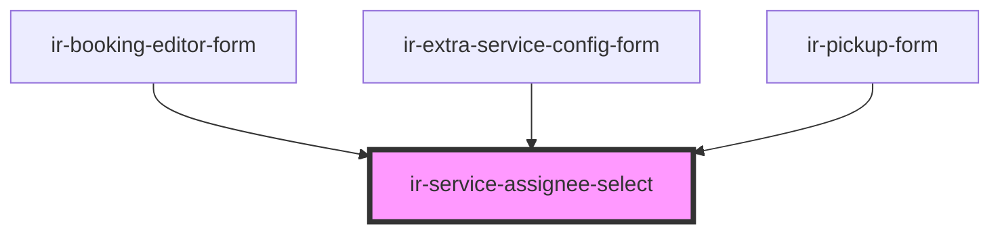

# ir-service-assignee-select

<!-- Auto Generated Below -->

## Properties

| Property       | Attribute       | Description                                    | Type                                          | Default             |
| -------------- | --------------- | ---------------------------------------------- | --------------------------------------------- | ------------------- |
| `agent`        | --              | The agent to assign the service to.            | `{ id: number; name: string; code: string; }` | `undefined`         |
| `assigneeType` | `assignee-type` | Currently selected service assignee type.      | `"agent" \| "guest"`                          | `'agent'`           |
| `label`        | `label`         | Label displayed above the assignment selector. | `string`                                      | `'Assign to folio'` |

## Events

| Event              | Description                              | Type                              |
| ------------------ | ---------------------------------------- | --------------------------------- |
| `assignmentChange` | Emits when the service assignee changes. | `CustomEvent<"agent" \| "guest">` |

## Dependencies

### Used by

 - [ir-booking-editor-form](../../igloo-calendar/ir-booking-editor/ir-booking-editor-form)
 - [ir-extra-service-config-form](../ir-extra-services/ir-extra-service-config/ir-extra-service-config-form)
 - [ir-pickup-form](../ir-pickup/ir-pickup-form)

### Graph

----------------------------------------------

*Built with [StencilJS](https://stenciljs.com/)*
