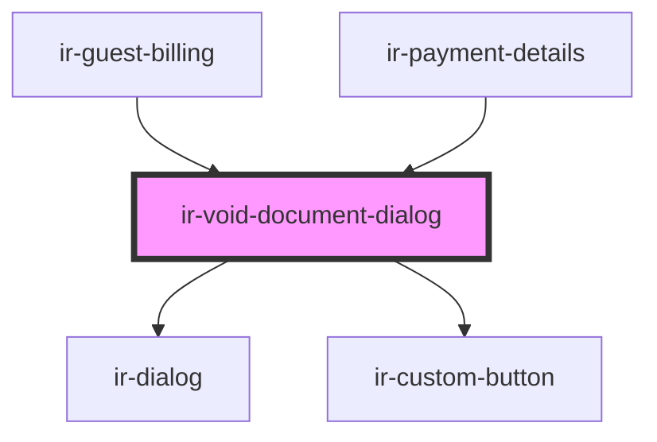

# ir-void-document-dialog

<!-- Auto Generated Below -->

## Events

| Event            | Description                                                                                                                                                                                                                    | Type                                                                                                 |
| ---------------- | ------------------------------------------------------------------------------------------------------------------------------------------------------------------------------------------------------------------------------ | ---------------------------------------------------------------------------------------------------- |
| `documentVoided` | Emitted once a document has actually been voided server-side. Consumers listen for this to refresh whatever data they own — e.g. ir-guest-billing refetches its own rows, ir-payment-details forwards it into resetBookingEvt. | `CustomEvent<VoidDocumentRequest>`                                                                   |
| `toast`          |                                                                                                                                                                                                                                | `CustomEvent<ICustomToast & Partial<IToastWithButton> \| IDefaultToast & Partial<IToastWithButton>>` |

## Methods

### `close() => Promise<void>`

#### Returns

Type: `Promise<void>`

### `open(request: VoidDocumentRequest) => Promise<void>`

#### Parameters

| Name      | Type                  | Description |
| --------- | --------------------- | ----------- |
| `request` | `VoidDocumentRequest` |             |

#### Returns

Type: `Promise<void>`

## Dependencies

### Used by

 - [ir-guest-billing](../../ir-billing/ir-guest-billing)
 - [ir-payment-details](../ir-payment-details)

### Depends on

- [ir-dialog](../../ui/ir-dialog)
- [ir-custom-button](../../ui/ir-custom-button)

### Graph

----------------------------------------------

*Built with [StencilJS](https://stenciljs.com/)*
