# ir-booking-details

<!-- Auto Generated Below -->

## Properties

| Property             | Attribute            | Description | Type      | Default     |
| -------------------- | -------------------- | ----------- | --------- | ----------- |
| `bookingNumber`      | `booking-number`     |             | `string`  | `''`        |
| `hasCheckIn`         | `has-check-in`       |             | `boolean` | `false`     |
| `hasCheckOut`        | `has-check-out`      |             | `boolean` | `false`     |
| `hasCloseButton`     | `has-close-button`   |             | `boolean` | `false`     |
| `hasDelete`          | `has-delete`         |             | `boolean` | `false`     |
| `hasMenu`            | `has-menu`           |             | `boolean` | `false`     |
| `hasPrint`           | `has-print`          |             | `boolean` | `false`     |
| `hasReceipt`         | `has-receipt`        |             | `boolean` | `false`     |
| `hasRoomAdd`         | `has-room-add`       |             | `boolean` | `false`     |
| `hasRoomDelete`      | `has-room-delete`    |             | `boolean` | `false`     |
| `hasRoomEdit`        | `has-room-edit`      |             | `boolean` | `false`     |
| `is_from_front_desk` | `is_from_front_desk` |             | `boolean` | `false`     |
| `language`           | `language`           |             | `string`  | `''`        |
| `p`                  | `p`                  |             | `string`  | `undefined` |
| `propertyid`         | `propertyid`         |             | `number`  | `undefined` |
| `ticket`             | `ticket`             |             | `string`  | `''`        |

## Events

| Event            | Description | Type                                                                                                 |
| ---------------- | ----------- | ---------------------------------------------------------------------------------------------------- |
| `bookingChanged` |             | `CustomEvent<Booking>`                                                                               |
| `closeSidebar`   |             | `CustomEvent<null>`                                                                                  |
| `toast`          |             | `CustomEvent<ICustomToast & Partial<IToastWithButton> \| IDefaultToast & Partial<IToastWithButton>>` |

## Dependencies

### Used by

 - [igloo-calendar](../igloo-calendar)
 - [ir-booking](../ir-booking)
 - [ir-booking-listing](../ir-booking-listing)

### Depends on

- [ir-guest-info](../ir-guest-info)
- [ir-pickup](ir-pickup)
- [ir-booking-extra-note](ir-booking-extra-note)
- [ir-extra-service-config](./ir-extra-services/ir-extra-service-config)
- [ir-spinner](../ui/ir-spinner)
- [ir-toast](../ui/ir-toast)
- [ir-interceptor](../ir-interceptor)
- [ir-booking-header](ir-booking-header)
- [ir-reservation-information](ir-reservation-information)
- [ir-date-view](../ir-date-view)
- [ir-button](../ui/ir-button)
- [ir-room](ir-room)
- [ir-pickup-view](ir-pickup-view)
- [ir-extra-services](ir-extra-services)
- [ir-payment-details](ir-payment-details)
- [ir-sidebar](../ui/ir-sidebar)
- [igl-book-property](../igloo-calendar/igl-book-property)

### Graph

```mermaid
graph TD;
  ir-booking-details --> ir-guest-info
  ir-booking-details --> ir-pickup
  ir-booking-details --> ir-booking-extra-note
  ir-booking-details --> ir-extra-service-config
  ir-booking-details --> ir-spinner
  ir-booking-details --> ir-toast
  ir-booking-details --> ir-interceptor
  ir-booking-details --> ir-booking-header
  ir-booking-details --> ir-reservation-information
  ir-booking-details --> ir-date-view
  ir-booking-details --> ir-button
  ir-booking-details --> ir-room
  ir-booking-details --> ir-pickup-view
  ir-booking-details --> ir-extra-services
  ir-booking-details --> ir-payment-details
  ir-booking-details --> ir-sidebar
  ir-booking-details --> igl-book-property
  ir-guest-info --> ir-icon
  ir-guest-info --> ir-input-text
  ir-guest-info --> ir-select
  ir-guest-info --> ir-phone-input
  ir-guest-info --> ir-textarea
  ir-guest-info --> ir-button
  ir-phone-input --> ir-combobox
  ir-button --> ir-icons
  ir-pickup --> ir-title
  ir-pickup --> ir-select
  ir-pickup --> ir-date-picker
  ir-pickup --> ir-input-text
  ir-pickup --> ir-button
  ir-title --> ir-icon
  ir-booking-extra-note --> ir-title
  ir-booking-extra-note --> ir-textarea
  ir-booking-extra-note --> ir-button
  ir-extra-service-config --> ir-title
  ir-extra-service-config --> ir-date-picker
  ir-extra-service-config --> ir-button
  ir-extra-service-config --> ir-price-input
  ir-booking-header --> ir-pms-logs
  ir-booking-header --> ir-events-log
  ir-booking-header --> ir-select
  ir-booking-header --> ir-button
  ir-booking-header --> ir-dialog
  ir-pms-logs --> ir-spinner
  ir-events-log --> ir-spinner
  ir-dialog --> ir-icon
  ir-reservation-information --> ir-label
  ir-reservation-information --> ir-tooltip
  ir-reservation-information --> ir-icons
  ir-reservation-information --> ir-button
  ir-reservation-information --> ota-label
  ir-room --> ir-button
  ir-room --> ir-date-view
  ir-room --> ir-label
  ir-room --> ir-modal
  ir-modal --> ir-button
  ir-pickup-view --> ir-button
  ir-extra-services --> ir-extra-service
  ir-extra-service --> ir-button
  ir-extra-service --> ir-date-view
  ir-extra-service --> ir-modal
  ir-payment-details --> ir-date-picker
  ir-payment-details --> ir-button
  ir-payment-details --> ir-label
  ir-payment-details --> ir-payment-actions
  ir-payment-details --> ir-modal
  ir-payment-actions --> ir-button
  ir-sidebar --> ir-icon
  igl-book-property --> igl-block-dates-view
  igl-book-property --> ir-button
  igl-book-property --> ir-icon
  igl-book-property --> igl-booking-overview-page
  igl-book-property --> igl-booking-form
  igl-block-dates-view --> ir-date-view
  igl-booking-overview-page --> igl-book-property-header
  igl-booking-overview-page --> igl-room-type
  igl-booking-overview-page --> igl-book-property-footer
  igl-book-property-header --> ir-autocomplete
  igl-book-property-header --> ir-select
  igl-book-property-header --> ir-button
  igl-book-property-header --> igl-date-range
  igl-date-range --> ir-date-range
  igl-date-range --> ir-date-picker
  igl-date-range --> ir-date-view
  igl-room-type --> igl-rate-plan
  igl-rate-plan --> ir-tooltip
  igl-rate-plan --> ir-price-input
  igl-book-property-footer --> ir-button
  igl-booking-form --> ir-date-view
  igl-booking-form --> igl-application-info
  igl-booking-form --> igl-property-booked-by
  igl-booking-form --> ir-button
  igl-application-info --> ir-tooltip
  igl-property-booked-by --> ir-autocomplete
  igl-property-booked-by --> ir-tooltip
  igl-property-booked-by --> ir-phone-input
  igloo-calendar --> ir-booking-details
  ir-booking --> ir-booking-details
  ir-booking-listing --> ir-booking-details
  style ir-booking-details fill:#f9f,stroke:#333,stroke-width:4px
```

----------------------------------------------

*Built with [StencilJS](https://stenciljs.com/)*
